# Flowchart FE ↔ BE — POS System

## Legend

```
[FE Page] → service function() → 🔵 GET /api/...
[FE Page] → service function() → 🟢 POST /api/...
[FE Page] → service function() → 🟡 PUT /api/...
[FE Page] → service function() → 🔴 DELETE /api/...
[FE Page] → service function() → 🟣 PATCH /api/...

──► chain/dependency flow
~~► optional chain
```

---

## 1. MASTER DATA (Produk, Kategori, Supplier)

```mermaid
flowchart TD
    A["/category-list"] --> B["getAllCategoryTable()"]
    B --> BE1["🔵 GET /category/get-category-all?store=&page=&limit=&statusCategory="]
    A --> BE2["🔴 DELETE /category/delete-category/{id}"]
    A --> BE3["🟢 POST /category/download-template"]
    A --> BE4["🟢 POST /category/download-excel"]

    C["/add-category"] --> D["addCategory()"]
    D --> BE5["🟢 POST /category/add-new-category"]

    E["/edit-category"] --> F["getCategoryById()"]
    F --> BE6["🔵 GET /category/get-category-by-id/{id}"]
    E --> G["editCategory()"]
    G --> BE7["🟡 PUT /category/edit-category/{id}"]

    H["/sub-category-list"] --> I["getAllSubCategory()"]
    I --> BE8["🔵 GET /sub-category/get-all-sub-category?store="]
    H --> BE9["🔴 DELETE /sub-category/delete-subcategory/{id}"]

    J["/add-sub-category"] --> K["addSubCategory()"]
    K --> BE10["🟢 POST /sub-category/add-subcategory"]

    L["/edit-sub-category"] --> M["editSubCategory()"]
    M --> BE11["🟡 PUT /sub-category/edit-subcategory/{id}"]

    N["/product-list"] --> O["getAllProduct()"]
    O --> BE12["🔵 GET /product?store=&page=&limit=&search=&category=&status="]

    P["/add-product"] --> Q["addProduct()"]
    Q --> BE13["🟢 POST /product/add-new-product"]
    P --> R["getAllCategoryTable()"]
    R --> BE1
    P --> S["getAllTaxConfig()"]
    S --> BE14["🔵 GET /tax-config?store=&page=&limit=&search="]

    T["/edit-product"] --> U["getProductById()"]
    U --> BE15["🔵 GET /product/{id}"]
    T --> V["editProduct()"]
    V --> BE16["🟡 PUT /product/{id}"]

    W["/supplier"] --> X["getAllSupplier()"]
    X --> BE17["🔵 GET /supplier?location=&page=&limit=&search="]
    W --> BE18["🔴 DELETE /supplier/{id}"]

    Y["/add-supplier"] --> Z["addSupplier()"]
    Z --> BE19["🟢 POST /supplier/add-new-supplier"]

    AA["/edit-supplier"] --> AB["editSupplier()"]
    AB --> BE20["🟡 PUT /supplier/{id}"]
```

### Field Mapping Kritis — Add Product

```json
{
  "name": "string*",
  "sku": "string (auto-hint SKU-{timestamp})",
  "productType": "'simple' | 'service'",
  "idCategory": "number*",
  "purchasePrice": "number",
  "description": "string",
  "isActive": "boolean",
  "options": "[{ name, price, stock }]", // <-- per variant: string[] → object[]
  "taxes": "[{ id: number }]",
  "images": "File[]"
}
```

---

## 2. MASTER DATA (Pajak, Price Template, Diskon, Tipe Bayar, Shift)

```mermaid
flowchart TD
    A["/tax-list"] --> B["getAllTaxConfig()"]
    B --> BE1["🔵 GET /tax-config?store=&page=&limit=&search="]
    A --> BE2["🔴 DELETE /tax-config/{id}"]

    C["/add-tax"] --> D["addTaxConfig()"]
    D --> BE3["🟢 POST /tax-config/add-new-tax"]

    E["/price-list-template"] --> F["getAllPriceListTemplate()"]
    F --> BE4["🔵 GET /price-list-template?store=&page=&limit="]

    G["/discount-list"] --> H["getAllDiscount()"]
    H --> BE5["🔵 GET /discount/get-discount?store=&page=&limit=&status="]
    G --> BE6["🔴 DELETE /discount/delete-discount/{id}"]

    I["/add-discount"] --> J["addDiscount()"]
    J --> BE7["🟢 POST /discount/add-new-discount"]

    K["/type-payment-list"] --> L["getAllTypePaymentListActive()"]
    L --> BE8["🔵 GET /type-payment/get-type-payment?store=&page=&limit=&status="]
    K --> BE9["🔴 DELETE /type-payment/delete-type-payment/{id}"]

    M["/add-type-payment"] --> N["addTypePayment()"]
    N --> BE10["🟢 POST /type-payment/add-new-type-payment"]

    O["/shift-list"] --> P["getAllShift()"]
    P --> BE11["🔵 GET /shift/get-shift?store=&page=&limit=&status="]
    O --> BE12["🔴 DELETE /shift/delete-shift/{id}"]

    Q["/add-shift"] --> R["addShift()"]
    R --> BE13["🟢 POST /shift/add-new-shift"]
```

### Field Mapping — Discount

```json
{
  "name": "string*",
  "type": "'Persentase' | 'Nominal'*",
  "value": "number*",
  "startDate": "date*",
  "endDate": "date",
  "minPurchase": "number",
  "description": "string",
  "isActive": "boolean"
}
```

### Field Mapping — Type Payment

```json
{
  "name": "string*",
  "type": "'Tunai' | 'Non-Tunai' | 'Transfer'*",
  "description": "string",
  "isActive": "boolean"
}
```

### Field Mapping — Shift

```json
{
  "name": "string*",
  "startTime": "HH:mm*",
  "endTime": "HH:mm*",
  "description": "string",
  "isActive": "boolean"
}
```

---

## 3. MEMBER, TIER, EMPLOYEE, POSITION, DEPARTMENT

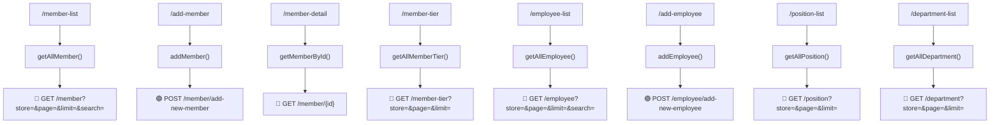

---

## 4. LOKASI (Store / Outlet)

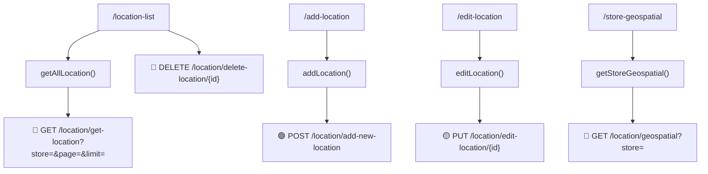

---

## 5. STOCK OVERSIGHT (Opname, History, Low Stock)

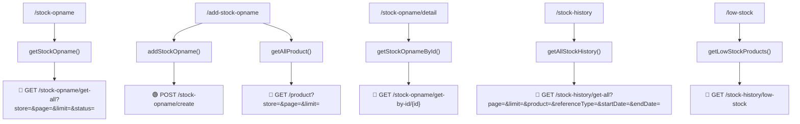

### Stock Chain — Critical Path

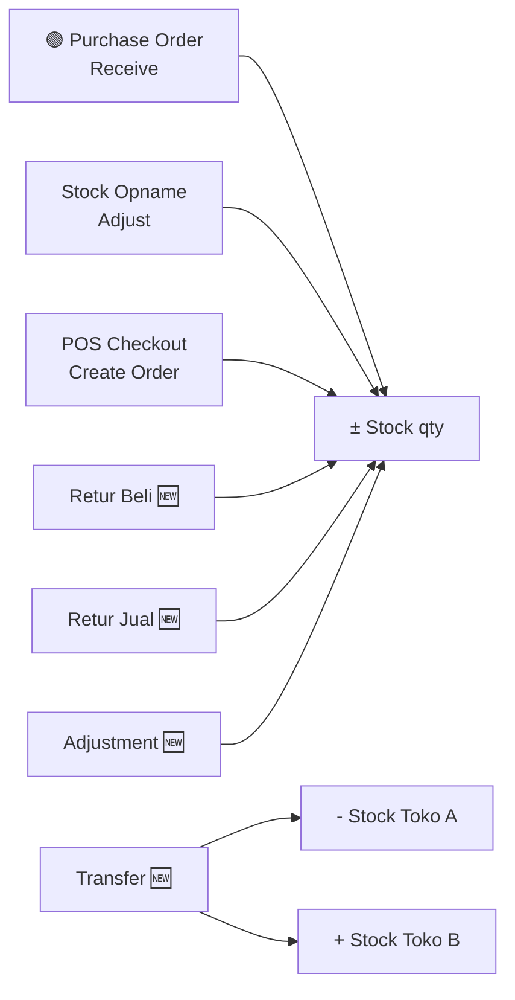

> **⚠️ Catatan BE:** Semua perubahan stok harus nulis ke `stock-history` table dengan `referenceType` yang sesuai (`purchase_receive`, `sale`, `opname_adjust`, `purchase_return`, `sale_return`, `transfer`, `adjustment`).

---

## 6. PURCHASE ORDER & TABLE

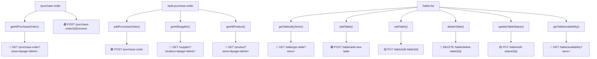

### Field Mapping — Purchase Order

```json
{
  "store": "number*",
  "supplier": "number*",
  "notes": "string",
  "items": "[{ product, qty, price }]*"
}
// Response expected:
{
  "data": [{
    "id": 1,
    "store": 1,
    "supplier": { id, name },
    "notes": "...",
    "status": "open | received | cancelled",
    "items": [{ product: { id, name }, qty, price }],
    "createdAt": "ISO8601"
  }],
  "pagination": { total, totalPages }
}
```

### Field Mapping — Table

```json
{
  "name": "string*",
  "capacity": "number*",
  "status": "'available' | 'occupied' | 'reserved'*",
  "store": "number*"
}
```

---

## 7. EXPENSE (Biaya + Kategori)

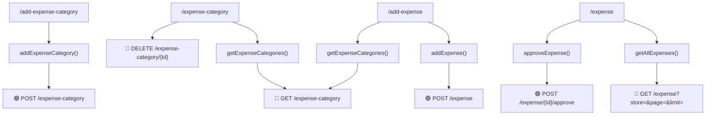

### Field Mapping — Expense

```json
{
  "categoryId": "number*",
  "description": "string*",
  "amount": "number*",
  "date": "date*",
  "notes": "string",
  "store": "number"
}
// Response expected:
{
  "data": [{
    "id": 1,
    "category": { id, name },
    "description": "...",
    "amount": 50000,
    "date": "ISO8601",
    "status": "pending | approved",
    "store": 1
  }],
  "pagination": { total, totalPages }
}
```

---

## 8. POS FLOW — CORE TRANSACTION (BELUM ADA FE PAGE)

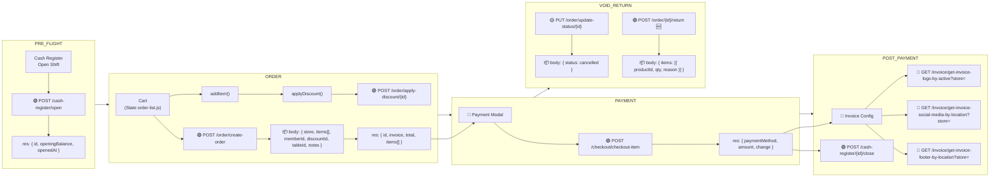

### Critical Chain CREATE ORDER → DEDUCT STOCK → UPDATE HISTORY

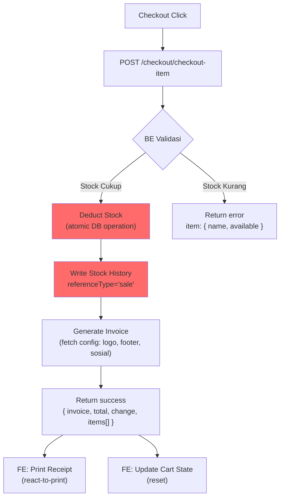

> **⚠️ Catatan BE:** `POST /checkout/checkout-item` harus atomic:
>
> 1. Validasi stok semua item
> 2. Kurangi stok (per variant option jika ada)
> 3. Tulis stock history dengan `referenceType='sale'`
> 4. Generate invoice number
> 5. Return response lengkap

---

## 9. INVOICE CONFIG (Logo, Footer, Sosial Media) — SERVICE EXISTS

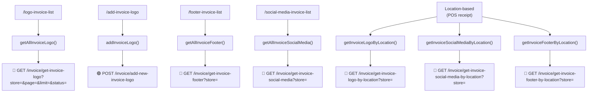

---

## 10. FULL SYSTEM CHAIN — ALL FEATURES

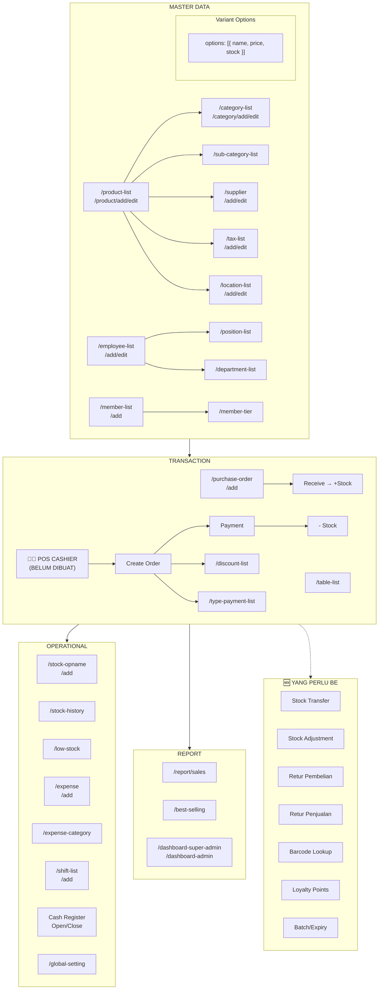

---

## 11. RESPONSE STRUCTURE WAJARAN — STANDARD YANG DIHARAPKAN FE

Semua service FE mengharapkan response dengan struktur berikut:

### GET (List)

```json
{
  "data": [{ ...objects }],
  "pagination": {
    "total": 100,
    "totalPages": 10,
    "page": 1,
    "limit": 10
  },
  "stats": {
    "total": 100,
    "active": 80,
    "inactive": 20
  }
}
```

### GET (Detail / By ID)

```json
{
  "data": { ...singleObject }
}
```

### POST / PUT

```json
{
  "data": { ...createdOrUpdatedObject },
  "message": "Success"
}
```

### DELETE

- Status: `200`, `201`, atau `204`
- Body: `{ "message": "Deleted" }` (optional)

---

## 12. CRITICAL NOTES — YANG PERLU DICOBAKAN SAMA BE

| #   | Issue                                                                                             | Dampak                                                        |
| --- | ------------------------------------------------------------------------------------------------- | ------------------------------------------------------------- |
| 1   | **Express default return 201** → FE service sudah fix terima 201/204                              | ✅ No action needed                                           |
| 2   | **Category endpoint** → `/category/get-category-all` (with `-all`) bukan `/category/get-category` | BE harus sediain endpoint ini                                 |
| 3   | **Product variant options** → FE kirim `[{ name, price, stock }]` bukan `["Large"]`               | BE harus parse sesuai                                         |
| 4   | **Purchase Order** → FE kirim `{ store, supplier, notes, items: [{ product, qty, price }] }`      | BE harus terima format ini                                    |
| 5   | **Stock opname items** → FE kirim `{ productId, ... }`                                            | BE perlu siapin kolom `productId` di tabel stock_opname_items |
| 6   | **Stock history referenceType** → FE filter pakai `referenceType` untuk categorisasi              | BE harus isi field ini                                        |
| 7   | **Product fields** → FE kirim `sku`, `productType`, `options`                                     | BE harus siapin kolom ini                                     |
| 8   | **Expense category** → `GET /expense-category` tanpa parameter                                    | Tidak ada filter store → bisa campur aduk                     |
| 9   | **Sub category** → `GET /sub-category/get-all-sub-category?store=`                                | Tidak ada pagination di FE — perlu ditambah?                  |
| 10  | **Discount/TipePayment/Shift** → Tidak ada `getById` endpoint                                     | FE filter client-side, tapi idealnya BE sediain get-by-id     |

---

> **Dibuat:** $(date +%d/%m/%Y) — Bisa-Nota POS System
