# PANDUAN SUPER ADMIN — Bisa Nota (Metro Retail)

> **Untuk siapa panduan ini?** Untuk pemilik bisnis, direktur operasional, dan Super Admin yang ingin mengerti alur kerja aplikasi secara menyeluruh tanpa perlu pusing soal teknis.
>
> **Aplikasi**: [bisa-nota-demo.vercel.app](https://bisa-nota-demo.vercel.app) | **API**: [api-bisa-nota.vercel.app](https://api-bisa-nota.vercel.app)

---

## Daftar Isi

1. [Gambaran Besar: Sistem Ini Ngapain Aja?](#1-gambaran-besar-sistem-ini-ngapain-aja)
2. [Alur Bisnis Utama](#2-alur-bisnis-utama)
3. [Menu per Menu — Bahasa Bisnis](#3-menu-per-menu--bahasa-bisnis)
4. [Hubungan Antar Fitur: Nyambungnya Kemana Aja?](#4-hubungan-antar-fitur-nyambungnya-kemana-aja)
5. [Diagram Alur Detail per Fitur](#5-diagram-alur-detail-per-fitur)
6. [Diagram Status / State Machine](#6-diagram-status--state-machine)
7. [Glossary / Istilah Penting](#7-glossary--istilah-penting)
8. [Aturan Bisnis Penting](#8-aturan-bisnis-penting)
9. [Tabel Role & Hak Akses](#9-tabel-role--hak-akses)
10. [List Update Fitur](#10-list-update-fitur-16-juni-2026)

---

## 1. Gambaran Besar: Sistem Ini Ngapain Aja?

Sistem ini mengelola **4 siklus bisnis utama** yang saling terhubung:

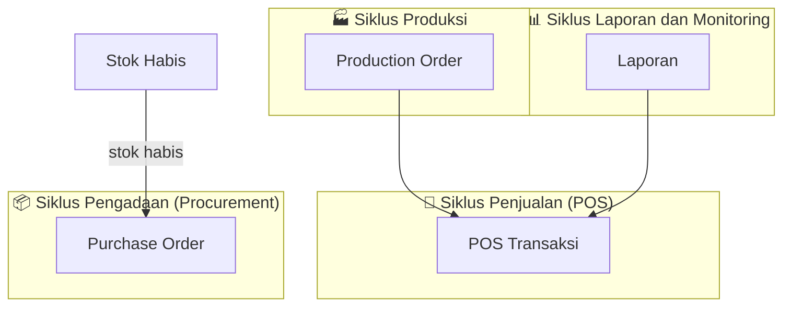
```mermaid
flowchart TB
    subgraph S1["🔄 Siklus Penjualan (POS)"]
        A1["POS Transaksi"]
    end

    subgraph S2["📦 Siklus Pengadaan (Procurement)"]
        B1["Purchase Order"]
    end

    subgraph S3["🏭 Siklus Produksi"]
        C4["Production Order"]
    end

    subgraph S4["📊 Siklus Laporan dan Monitoring"]
        D4["Laporan"]
    end

    A6["Stok Habis"] -->|stok habis| B1
    C4 --> A1
    D4 --> A1
```

**Ceritanya gini:**

1. **Pelanggan beli** → kasir catat di POS → stok berkurang → dapur dapet notifikasi
2. **Stok hampir habis** → bikin PO ke supplier → barang datang, stok nambah → bayar supplier
3. **Punya bahan baku?** → bikin production order → jadi barang siap jual
4. **Semua tercatat** → laporan penjualan, laba rugi, arus kas → bisa lihat performa bisnis

---

## 2. Alur Bisnis Utama

### Alur A: Siklus Penjualan — "Dari Pelanggan Datang Sampe Dapet Struk"

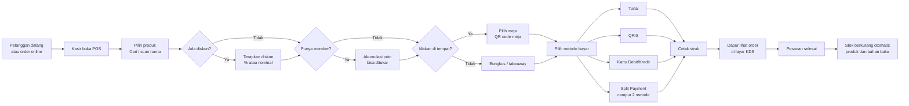
```mermaid
flowchart LR
    CUST[Pelanggan datang<br/>atau order online] --> KASIR[Kasir buka POS]

    KASIR --> ITEM[Pilih produk<br/>Cari / scan nama]
    ITEM --> DISKON{Ada diskon?}
    DISKON -->|Ya| APPLY_DIS[Terapkan diskon<br/>% atau nominal]
    DISKON -->|Tidak| MEMBER{Punya member?}
    APPLY_DIS --> MEMBER

    MEMBER -->|Ya| POIN[Akumulasi poin<br/>bisa ditukar]
    MEMBER -->|Tidak| DINE_IN{Makan di tempat?}
    POIN --> DINE_IN

    DINE_IN -->|Ya| MEJA[Pilih meja<br/>QR code meja]
    DINE_IN -->|Tidak| BUNGKUS[Bungkus / takeaway]
    MEJA --> BAYAR
    BUNGKUS --> BAYAR

    BAYAR[Pilih metode bayar] --> TUNAI[Tunai]
    BAYAR --> QRIS[QRIS]
    BAYAR --> KARTU[Kartu Debit/Kredit]
    BAYAR --> SPLIT[Split Payment<br/>campur 2 metode]

    TUNAI --> STRUK[Cetak struk]
    QRIS --> STRUK
    KARTU --> STRUK
    SPLIT --> STRUK

    STRUK --> DAPUR[Dapur lihat order<br/>di layar KDS]
    DAPUR --> SELESAI[Pesanan selesai]
    SELESAI --> STOK[Stok berkurang otomatis<br/>produk dan bahan baku]
```

**Yang perlu kamu tau:**

- POS ini bisa **split payment** (bayar pake 2 metode sekaligus)
- Kalau pelanggan **member**, poin otomatis keakumulasi
- **Dapur otomatis dapet notifikasi** order baru (KDS — Kitchen Display System)
- **Stok berkurang otomatis** begitu transaksi selesai

---

### Alur B: Siklus Pengadaan — "Dari Stok Abis Sampe Bayar Supplier"

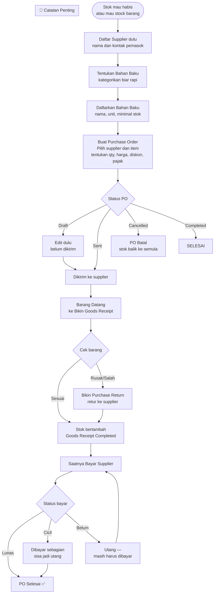
```mermaid
flowchart TB
    AWAL([Stok mau habis<br/>atau mau stock barang])

    AWAL --> DAFTAR_SUPP[Daftar Supplier dulu<br/>nama dan kontak pemasok]

    DAFTAR_SUPP --> KATEGORI[Tentukan Bahan Baku<br/>kategorikan biar rapi]
    KATEGORI --> BAHAN[Daftarkan Bahan Baku<br/>nama, unit, minimal stok]

    BAHAN --> PO[Buat Purchase Order<br/>Pilih supplier dan item<br/>tentukan qty, harga, diskon, pajak]

    PO --> STAT_PO{Status PO}
    STAT_PO -->|Draft| EDIT[Edit dulu<br/>belum dikirim]
    STAT_PO -->|Sent| TERKIRIM[Dikirim ke supplier]
    STAT_PO -->|Cancelled| BATAL[PO Batal<br/>stok balik ke semula]
    STAT_PO -->|Completed| SELESAI

    EDIT --> TERKIRIM

    TERKIRIM --> TERIMA[Barang Datang<br/>ke  Bikin Goods Receipt]
    TERIMA --> CEK{Cek barang}
    CEK -->|Sesuai| STOK_IN[Stok bertambah<br/>Goods Receipt Completed]
    CEK -->|Rusak/Salah| RETUR[Bikin Purchase Return<br/>retur ke supplier]
    RETUR --> STOK_IN

    STOK_IN --> BAYAR_SUPP[Saatnya Bayar Supplier]
    BAYAR_SUPP --> STATUS_BAYAR{Status bayar}
    STATUS_BAYAR -->|Lunas| LUNAS[PO Selesai ✅]
    STATUS_BAYAR -->|Cicil| CICIL[Dibayar sebagian<br/>sisa jadi utang]
    STATUS_BAYAR -->|Belum| HUTANG[Utang —<br/>masih harus dibayar]

    CICIL --> LUNAS
    HUTANG --> BAYAR_SUPP

    subgraph KETERANGAN["🧾 Catatan Penting"]
    end
```

**Yang perlu kamu tau:**

- Ada **due date** (jatuh tempo) di setiap PO — tau kapan harus bayar supplier
- Kalau **PO atau GR dibatalkan**, stok **otomatis kembali** ke semula (gak perlu manual)
- Bisa bayar supplier **dicicil** — sistem catat otomatis sisa utangnya
- Semua pembayaran supplier terekam di **Riwayat Pembayaran**

---

### Alur C: Siklus Produksi & Stok — "Dari Bahan Mentah Jadi Barang Jual"

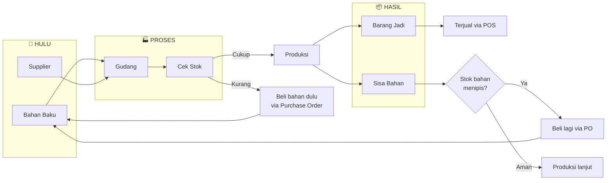
```mermaid
flowchart LR
    subgraph HULU["🌾 HULU"]
        A["Bahan Baku"]
        B["Supplier"]
    end

    subgraph PROSES["🏭 PROSES"]
        C["Gudang"]
        D["Cek Stok"]
    end

    subgraph HASIL["📦 HASIL"]
        E["Barang Jadi"]
        F["Sisa Bahan"]
    end

    A --> C
    B --> C
    C --> D
    D -->|Cukup| PRODUCE[Produksi]
    D -->|Kurang| PO[Beli bahan dulu<br/>via Purchase Order]
    PO --> A

    PRODUCE --> E
    PRODUCE --> F

    E --> JUAL[Terjual via POS]
    F --> ALERT{Stok bahan<br/>menipis?}
    ALERT -->|Ya| BELI_LAGI[Beli lagi via PO]
    ALERT -->|Aman| AMAN[Produksi lanjut]

    BELI_LAGI --> A
```

**Yang perlu kamu tau:**

- **BOM (Bill of Materials)** = resep atau komposisi produk. Misal: 1 porsi Nasi Goreng butuh 200gr nasi, 3 siung bawang, dll
- Waktu produksi, stok **bahan baku berkurang otomatis** dan **barang jadi nambah otomatis**
- Kalau bahan kurang, sistem **ngasih tau** — tinggal bikin PO ke supplier
- Ada **Low Stock Alert** buat stok yang mau habis

---

### Alur D: Siklus Uang — "Dari Mana Duit Datang, Kemana Duit Pergi"

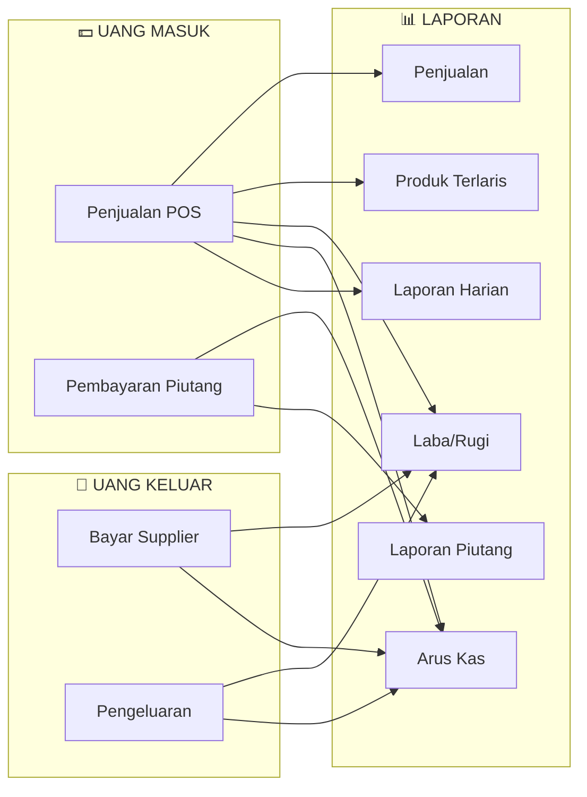
```mermaid
flowchart LR
    subgraph MASUK["💵 UANG MASUK"]
        POS["Penjualan POS"]
        AR["Pembayaran Piutang"]
    end

    subgraph KELUAR["💸 UANG KELUAR"]
        PO_BAYAR["Bayar Supplier"]
        EXP["Pengeluaran"]
    end

    subgraph LAPORAN["📊 LAPORAN"]
        SALES["Penjualan"]
        BEST["Produk Terlaris"]
        PL["Laba/Rugi"]
        CASH["Arus Kas"]
        DAILY["Laporan Harian"]
        AR_REPORT["Laporan Piutang"]
    end

    POS --> SALES
    POS --> BEST
    POS --> PL
    AR --> CASH
    PO_BAYAR --> PL
    EXP --> PL
    POS --> CASH
    PO_BAYAR --> CASH
    EXP --> CASH
    POS --> DAILY
    AR --> AR_REPORT
```

**Yang perlu kamu tau:**

- Bisa lihat **produk apa yang paling laku** (best selling) — ini penting buat strategi bisnis
- **Laba/Rugi** ngitung otomatis dari penjualan dikurang pengeluaran (belanja supplier, biaya operasional)
- Semua laporan bisa **di-export ke Excel**
- **Arus Kas** ngasih tau kondisi cashflow bisnis secara real-time

---

## 3. Menu per Menu — Bahasa Bisnis

### 🏠 Dashboard

| Menu                      | Fungsinya buat bisnis                                                          | Nyambung kemana |
| ------------------------- | ------------------------------------------------------------------------------ | --------------- |
| **Dashboard Super Admin** | Lihat omzet & statistik SEMUA toko dalam satu layar. Gak perlu buka satu-satu. | —               |
| **Dashboard Admin**       | Lihat omzet per toko tertentu.                                                 | —               |

### 🛒 Kasir

| Menu                    | Fungsinya buat bisnis                                                                        | Nyambung kemana                                     |
| ----------------------- | -------------------------------------------------------------------------------------------- | --------------------------------------------------- |
| **POS (Point of Sale)** | Layar kasir buat transaksi jualan. Cari produk, pilih meja, pilih metode bayar, cetak struk. | ➡ Stok berkurang ➡ Laporan penjualan ➡ KDS dapur |
| **Buka/Tutup Kasir**    | Catat uang awal shift & hitung akhir shift. Biar tau ada selisih atau nggak.                 | ➡ Riwayat Kasir                                    |
| **Riwayat Kasir**       | Lihat history transaksi per shift. Cocok buat audit.                                         | —                                                   |

### 🏪 Kelola Toko

| Menu              | Fungsinya buat bisnis                                | Nyambung kemana                                            |
| ----------------- | ---------------------------------------------------- | ---------------------------------------------------------- |
| **Daftar Lokasi** | Tambah cabang baru, edit alamat & jam operasional.   | ➡ Semua fitur lain (setiap transaksi milik toko tertentu) |
| **Peta Toko**     | Lihat semua cabang di peta. Biar tau sebaran bisnis. | —                                                          |

### 📦 Produk

| Menu              | Fungsinya buat bisnis                                                                           | Nyambung kemana                   |
| ----------------- | ----------------------------------------------------------------------------------------------- | --------------------------------- |
| **Kategori**      | Grouping produk (Makanan, Minuman, Snack, dll). Biar rapi di POS.                               | ➡ Daftar Produk                  |
| **Daftar Produk** | Daftar semua barang jualan: nama, harga, gambar, komposisi. Yang dijual di POS semua dari sini. | ➡ POS ➡ BOM ➡ Production Order |

### 📋 Pengadaan (Procurement) — **Modul Kunci**

| Menu                    | Fungsinya buat bisnis                                                                                             | Nyambung kemana                              |
| ----------------------- | ----------------------------------------------------------------------------------------------------------------- | -------------------------------------------- |
| **Supplier**            | Data pemasok: nama, kontak, alamat, produk beserta harga/lead time/quality. Siapa aja yang nyuplai barang.       | ➡ Purchase Order ➡ Bandingkan Supplier       |
| **Kategori Bahan Baku** | Grouping bahan baku (Sembako, Bumbu, Frozen, dll).                                                                | ➡ Bahan Baku                                |
| **Bahan Baku**          | Daftar ingredient: nama, unit, minimal stok. Bahan baku yang dipake buat produksi.                                | ➡ Purchase Order ➡ BOM ➡ Production Order |
| **Purchase Order**      | Bikin pesanan ke supplier. Pilih supplier & item. Ada status (draft/sent/completed/cancelled), due date, dan PIC. | ➡ Goods Receipt ➡ Riwayat Pembayaran       |
| **Riwayat Pembayaran**  | Catat pembayaran PO: lunas / cicil / belum bayar. Tau total utang ke supplier.                                    | ➡ Purchase Order                            |

### 🚚 Pengiriman (Delivery)

| Menu                     | Fungsinya buat bisnis                                                                       | Nyambung kemana                    |
| ------------------------ | ------------------------------------------------------------------------------------------- | ---------------------------------- |
| **Delivery Orders**      | Kelola pesanan pengiriman: assign driver, lacak status, catat riwayat.                      | ➡ Driver ➡ Detail Delivery        |
| **Driver**               | Data driver: nama, kendaraan, plat nomor, status (active/busy/offline). Status otomatis.    | ➡ Delivery Orders                  |

### 🛒 Marketplace Integration

| Menu                     | Fungsinya buat bisnis                                                                       | Nyambung kemana                    |
| ------------------------ | ------------------------------------------------------------------------------------------- | ---------------------------------- |
| **Marketplace Orders**   | Pesanan dari GoFood/GrabFood/ShopeeFood masuk otomatis via webhook. Dilihat di satu tempat. | ➡ Delivery Order ➡ KDS            |
| **Produk Mapping**       | Map produk internal ke produk di marketplace. Nama & harga bisa beda per platform.           | ➡ Produk ➡ Marketplace            |
| **Menu Availability**    | Sinkronisasi ketersediaan produk ke semua marketplace. Habis di sistem → unavailable.        | ➡ Produk                           |
| **Commission Tracking**  | Catat komisi marketplace per pesanan (GoFood 15-25%, Grab 15-30%).                          | ➡ Laporan Laba/Rugi               |

### ⏳ Antrian (Queue)

| Menu                     | Fungsinya buat bisnis                                                                       | Nyambung kemana                    |
| ------------------------ | ------------------------------------------------------------------------------------------- | ---------------------------------- |
| **Queue Management**     | Kelola daftar tunggu pelanggan: tambah ke antrian, dudukkan, batalkan. Nomor auto-generate.  | ➡ Meja (status occupied/available) |

### 📊 Performa Supplier

| Menu                     | Fungsinya buat bisnis                                                                       | Nyambung kemana                    |
| ------------------------ | ------------------------------------------------------------------------------------------- | ---------------------------------- |
| **Supplier Performance** | Skor & grade supplier: on-time rate, defect rate, harga. Evaluasi otomatis dari PO & GR.    | ➡ Supplier ➡ Purchase Order       |
| **Bandingkan Supplier**  | Bandingkan harga, lead time, & kualitas supplier per produk. Cari supplier terbaik.          | ➡ Supplier                        |

### 🏷️ Promosi (Promo)

| Menu                     | Fungsinya buat bisnis                                                                       | Nyambung kemana                    |
| ------------------------ | ------------------------------------------------------------------------------------------- | ---------------------------------- |
| **Promo Campaigns**      | Kampanye promo otomatis: happy hour, birthday, buy X get Y. Auto-activate berdasarkan jadwal.| ➡ POS (diskon otomatis)            |

### 👥 Pelanggan

| Menu              | Fungsinya buat bisnis                                                                  | Nyambung kemana        |
| ----------------- | -------------------------------------------------------------------------------------- | ---------------------- |
| **Member Tier**   | Level member: Bronze, Silver, Gold, Platinum. Makin tinggi level, makin besar benefit. | ➡ Daftar Member       |
| **Daftar Member** | Data pelanggan, poin, history transaksi. Biar tau pelanggan paling loyal.              | ➡ POS (pas transaksi) |

### 💳 Transaksi

| Menu                       | Fungsinya buat bisnis                                                                                                            | Nyambung kemana          |
| -------------------------- | -------------------------------------------------------------------------------------------------------------------------------- | ------------------------ |
| **Diskon**                 | Atur promo & diskon (per item / per transaksi / member). Bisa set periode, minimal belanja, dan syarat lainnya.                  | ➡ POS (waktu transaksi) |
| **Piutang Pelanggan (AR)** | Catat penjualan kredit & pembayaran piutang. Lihat siapa aja yang masih punya tanggungan, total tagihan, dan status lunas/belum. | ➡ POS ➡ Laporan        |

### 👷 Karyawan

| Menu                | Fungsinya buat bisnis                            | Nyambung kemana |
| ------------------- | ------------------------------------------------ | --------------- |
| **Departemen**      | Divisi organisasi: Dapur, Kasir, Manajemen, dll. | ➡ Posisi       |
| **Posisi**          | Jabatan: Koki, Kasir, Supervisor, dll.           | ➡ Karyawan     |
| **Daftar Karyawan** | Data pegawai: gaji, kontrak, dokumen.            | ➡ Shift        |
| **Shift**           | Jadwal kerja. Biar tau siapa jaga kapan.         | —               |

### 👷 Karyawan

| Menu                | Fungsinya buat bisnis                            | Nyambung kemana |
| ------------------- | ------------------------------------------------ | --------------- |
| **Departemen**      | Divisi organisasi: Dapur, Kasir, Manajemen, dll. | ➡ Posisi       |
| **Posisi**          | Jabatan: Koki, Kasir, Supervisor, dll.           | ➡ Karyawan     |
| **Daftar Karyawan** | Data pegawai: gaji, kontrak, dokumen.            | ➡ Shift        |
| **Shift**           | Jadwal kerja. Biar tau siapa jaga kapan.         | —               |

### 📦 Manajemen Stok

| Menu                 | Fungsinya buat bisnis                                                         | Nyambung kemana     |
| -------------------- | ----------------------------------------------------------------------------- | ------------------- |
| **Stock Opname**     | Hitung stok fisik berkala. Deteksi selisih & otomatis sesuaikan stok.         | ➡ History Stok     |
| **History Stok**     | Mutasi stok: masuk darimana, keluar kemana. Cocok buat audit.                 | —                   |
| **Low Stock**        | Peringatan stok menipis. Langsung bisa bikin PO dari sini.                    | ➡ Purchase Order   |
| **Dapur (KDS)**      | Layar buat dapur — lihat order masuk real-time.                               | ➡ POS              |
| **Production Order** | Produksi barang jadi dari bahan baku. Stok bahan kurang → otomatis kasih tau. | ➡ POS ➡ BOM       |
| **BOM**              | Resep: 1 porsi Fanta Jeruk = 200ml Fanta + 1 jeruk peras.                     | ➡ Production Order |
| **Goods Receipt**    | Terima barang dari PO. Barang sesuai? Stok nambah. Gak sesuai? Retur.         | ➡ Purchase Return  |
| **Sales Return**     | Pelanggan balikin barang? Catat di sini, stok balik, uang balik.              | ➡ POS              |
| **Purchase Return**  | Retur barang ke supplier. Stok berkurang.                                     | ➡ Goods Receipt    |
| **Transfer Stok**    | Kirim **barang inventory/produk** antar cabang. Biar stok merata. Aset tetap (komputer, mesin) beda alur — hubungi tim support. | ➡ History Stok     |
| **Adjustment Stok**  | Sesuaikan stok produk secara manual — tambah atau kurangi. Cocok buat koreksi stok (barang rusak, hilang, kelebihan stok).      | ➡ History Stok     |

### 📈 Laporan

| Menu                | Fungsinya buat bisnis                                               | Nyambung kemana      |
| ------------------- | ------------------------------------------------------------------- | -------------------- |
| **Penjualan**       | Semua penjualan: filter tanggal, toko, kategori. Bisa export Excel. | —                    |
| **Produk Terlaris** | Produk paling laku. Buat strategi menu & stok.                      | —                    |
| **Laporan Harian**  | Rekap penjualan per hari.                                           | —                    |
| **Laba / Rugi**     | Pemasukan - pengeluaran = profit bersih.                            | —                    |
| **Arus Kas**        | Uang masuk & keluar. Biar tau kondisi cashflow.                     | —                    |
| **Piutang (AR)**    | Rekap piutang pelanggan, status tagihan, total outstanding.         | ➡ Piutang Pelanggan |

### ⚙️ Pengaturan

| Menu                  | Fungsinya buat bisnis                                       | Nyambung kemana            |
| --------------------- | ----------------------------------------------------------- | -------------------------- |
| **Invoice & Struk**   | Atur tampilan struk: logo, footer, ucapan terima kasih.     | ➡ POS (waktu cetak struk) |
| **Pajak**             | Atur PPN & pajak lainnya.                                   | ➡ Purchase Order ➡ POS   |
| **Metode Pembayaran** | Jenis pembayaran: Tunai, QRIS, Kartu, Transfer.             | ➡ POS                     |
| **Role & Izin**       | Atur siapa bisa akses apa. Admin, Kasir, User — beda akses. | ➡ Semua fitur             |
| **Harga per Toko**    | Harga jual beda per cabang.                                 | ➡ POS                     |
| **Meja**              | Atur meja & QR code. Pelanggan bisa scan & order sendiri.   | ➡ POS ➡ Customer Order   |

---

## 4. Hubungan Antar Fitur: Nyambungnya Kemana Aja?

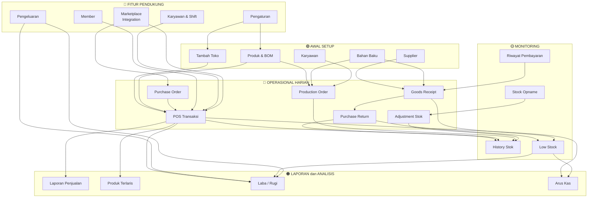
```mermaid
flowchart TB
    subgraph AWAL["🟢 AWAL SETUP"]
        A1["Tambah Toko"]
        A2["Produk & BOM"]
        A3["Supplier"]
        A4["Bahan Baku"]
        A5["Karyawan"]
    end

    subgraph OPERASIONAL["🔵 OPERASIONAL HARIAN"]
        B1["POS Transaksi"]
        B2["Purchase Order"]
        B3["Goods Receipt"]
        B4["Purchase Return"]
        B5["Production Order"]
        B6["Adjustment Stok"]
    end

    subgraph MONITOR["🟡 MONITORING"]
        C1["Stock Opname"]
        C2["Riwayat Pembayaran"]
        C3["History Stok"]
        C4["Low Stock"]
    end

    subgraph LAPORAN["🟠 LAPORAN dan ANALISIS"]
        D1["Laporan Penjualan"]
        D2["Produk Terlaris"]
        D3["Laba / Rugi"]
        D4["Arus Kas"]
    end

    subgraph LAIN["🔴 FITUR PENDUKUNG"]
        E1["Member"]
        E2["Karyawan & Shift"]
        E3["Pengeluaran"]
        E4["Pengaturan"]
        E5["Marketplace<br/>Integration"]
    end

    A1 --> B1
    A2 --> B1
    A2 --> B5
    A3 --> B3
    A4 --> B3
    A4 --> B5
    A5 --> B5

    B1 --> C3
    B3 --> B4
    B4 --> C3
    B5 --> C3
    B2 --> B1

    B4 --> C4
    B3 --> C4
    C2 --> B3
    C1 --> B6
    B6 --> C3

    B1 --> D1
    B1 --> D2
    B1 --> D3
    B1 --> D4
    E3 --> D3
    C4 --> D3
    C4 --> D4

    E1 --> B1
    E2 --> B1
    E3 --> D3
    E4 --> A1
    E4 --> A2
    E5 --> B1
    E5 --> B2
```

**Bacanya gini:**

- 🟢 **AWAL**: Setelah toko & produk didaftarkan, baru bisa operasional
- 🔵 **OPERASIONAL**: POS buat jualan, PO buat beli stok, GR buat terima barang, Production Order buat produksi — ini kegiatan sehari-hari
- 🟡 **MONITORING**: Cek stok rutin biar gak kehabisan, catat pembayaran supplier biar gak lupa utang
- 🟠 **LAPORAN**: Dari semua kegiatan, laporan otomatis tergenerate — tinggal buka & analisis
- 🔴 **PENDUKUNG**: Member, karyawan, pengaturan, marketplace integration — fitur pendukung biar bisnis jalan mulus. Marketplace nerima pesanan dari GoFood/GrabFood/ShopeeFood via webhook, otomatis jadi Delivery Order

---

## 5. Diagram Alur Detail per Fitur

> Berikut diagram teknis & rinci untuk setiap fitur. Cocok buat Super Admin atau tim operasional yang mau ngerti langkah-langkah detail di setiap modul.

---

### 5.1 Auth — Login, Register, Reset Password

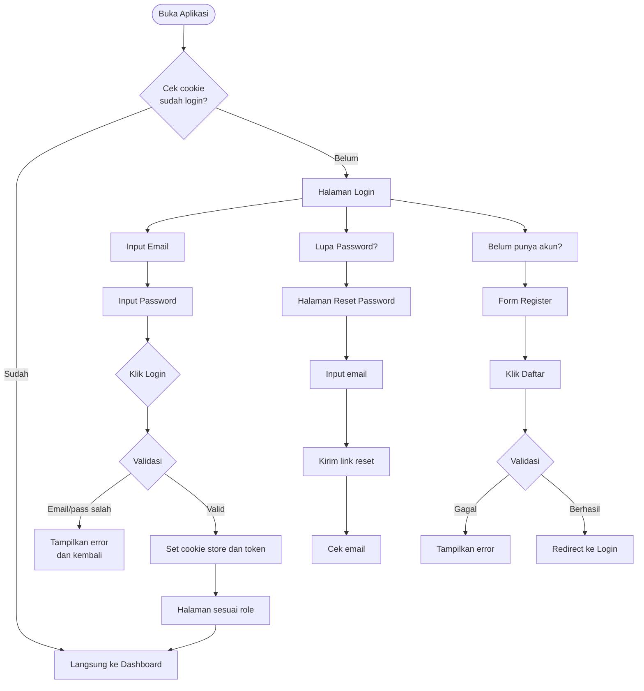
```mermaid
flowchart TD
    START([Buka Aplikasi]) --> CEK_COOKIE{Cek cookie<br/>sudah login?}
    CEK_COOKIE -->|Sudah| DASH[Langsung ke Dashboard]
    CEK_COOKIE -->|Belum| LOGIN[Halaman Login]

    LOGIN --> INPUT_EMAIL[Input Email]
    INPUT_EMAIL --> INPUT_PASS[Input Password]
    INPUT_PASS --> SUB_LOGIN{Klik Login}
    SUB_LOGIN --> VALID{Validasi}
    VALID -->|Email/pass salah| ERROR[Tampilkan error<br/>dan kembali]
    VALID -->|Valid| SET_COOKIE[Set cookie store dan token]
    SET_COOKIE --> REDIR[Halaman sesuai role]
    REDIR --> DASH

    LOGIN --> LUPAPASS[Lupa Password?]
    LUPAPASS --> RESET[Halaman Reset Password]
    RESET --> INPUT_EMAIL2[Input email]
    INPUT_EMAIL2 --> SEND_LINK[Kirim link reset]
    SEND_LINK --> CEK_EMAIL[Cek email]

    LOGIN --> REGISTER[Belum punya akun?]
    REGISTER --> FORM_REGIS[Form Register]
    FORM_REGIS --> SUB_REGIS[Klik Daftar]
    SUB_REGIS --> VALID_REGIS{Validasi}
    VALID_REGIS -->|Gagal| ERROR2[Tampilkan error]
    VALID_REGIS -->|Berhasil| REDIR2[Redirect ke Login]
```

**Roles yang tersedia:**

- **Super Admin** — akses semua toko & semua fitur
- **Admin** — akses per toko (disesuaikan)
- **Cashier** — akses POS + membership
- **User** — akses terbatas (laporan + dashboard)
- **Koki** — akses KDS dapur

---

### 5.2 Dashboard — Super Admin & Admin

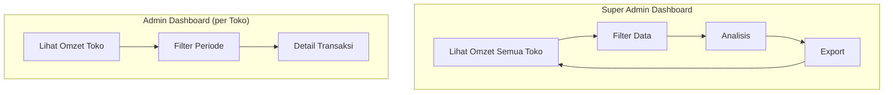
```mermaid
flowchart TD
    subgraph SUPER["Super Admin Dashboard"]
        SA1["Lihat Omzet Semua Toko"]
        SA2["Filter Data"]
        SA3["Analisis"]
        SA4["Export"]
    end

    subgraph ADMIN["Admin Dashboard (per Toko)"]
        AD1["Lihat Omzet Toko"]
        AD2["Filter Periode"]
        AD3["Detail Transaksi"]
    end

    SA1 --> SA2
    SA2 --> SA3
    SA3 --> SA4
    SA4 --> SA1

    AD1 --> AD2
    AD2 --> AD3
```

**Sumber data dashboard:**

- Semua transaksi POS (real-time)
- Modul Laporan (Penjualan, Best Selling)
- API perhitungan otomatis di backend

---

### 5.3 Kasir (POS) — Transaksi Penjualan Detail

```mermaid
flowchart TD
    START([Kasir buka POS]) --> CEK_REGISTER{Cek status register<br/>sudah buka?}
    CEK_REGISTER -->|Belum| BUKA[Buka Register dulu<br/>setor uang awal]
    CEK_REGISTER -->|Udah| CEK_STORE{Pilih toko<br/>multi-store}
    BUKA --> CEK_STORE

    CEK_STORE --> PELANGGAN{Pilih pelanggan?}
    PELANGGAN -->|Ya| CARI_MEMBER[Cari member<br/>nama/telepon]
    PELANGGAN -->|Tidak| LEWATI[Lewati]
    CARI_MEMBER --> PILIH_MEJA
    LEWATI --> PILIH_MEJA

    PILIH_MEJA{Pilih meja?}
    PILIH_MEJA -->|Ya| MEJA[Pilih nomor meja<br/>otomatis jadi dine-in]
    PILIH_MEJA -->|Tidak| BUNGKUS[Status: Takeaway]
    MEJA --> PILIH_PRODUK
    BUNGKUS --> PILIH_PRODUK

    PILIH_PRODUK[Pilih produk] --> CARI[Cari produk:<br/>1. Scan nama<br/>2. Pilih kategori<br/>3. Search manual]
    CARI --> QTY[Tentukan qty]
    QTY --> DISKON_ITEM{Ada diskon<br/>per item?}
    DISKON_ITEM -->|Ya| APPLY_DIS_ITEM[Input diskon % / nominal]
    DISKON_ITEM -->|Tidak| LANJUT

    APPLY_DIS_ITEM --> LANJUT
    LANJUT[Lanjut tambah produk] --> TAMBAH_LAGI{Tambah<br/>produk lagi?}
    TAMBAH_LAGI -->|Ya| PILIH_PRODUK
    TAMBAH_LAGI -->|Tidak| REVIEW[Review pesanan]

    REVIEW --> DISKON_TRX{Diskon transaksi?}
    DISKON_TRX -->|Ya| APPLY_DIS_TRX[Pilih diskon<br/>dari daftar diskon]
    DISKON_TRX -->|Tidak| HITUNG[Hitung total]
    APPLY_DIS_TRX --> HITUNG

    HITUNG --> METODE_BAYAR[Pilih metode bayar]
    METODE_BAYAR --> TUNAI[Tunai<br/>input jumlah uang]
    METODE_BAYAR --> QRIS[QRIS<br/>scan QR]
    METODE_BAYAR --> KARTU[Kartu<br/>debit/kredit]
    METODE_BAYAR --> SPLIT[Split Payment<br/>campur 2 metode]

    TUNAI --> HITUNG_KEMBALIAN[Hitung kembalian]
    QRIS --> PROSES_PAY[Proses pembayaran]
    KARTU --> PROSES_PAY
    SPLIT --> PROSES_PAY
    HITUNG_KEMBALIAN --> PROSES_PAY

    PROSES_PAY --> BAYAR_BERHASIL{Pembayaran<br/>berhasil?}
    BAYAR_BERHASIL -->|Gagal| METODE_BAYAR
    BAYAR_BERHASIL -->|Berhasil| STRUK

    STRUK[Cetak Struk] --> STRUK_OPSI{Pilih cetak}
    STRUK_OPSI --> THERMAL[Thermal Printer<br/>ukuran kecil]
    STRUK_OPSI --> A4[Printer A4<br/>ukuran besar]
    STRUK_OPSI --> TIDAK_STRUK[Tidak cetak]

    THERMAL --> KIRIM_DAPUR
    A4 --> KIRIM_DAPUR
    TIDAK_STRUK --> KIRIM_DAPUR

    KIRIM_DAPUR[Kirim ke Dapur<br/>via KDS] --> DAPUR_NOTIF[Dapur lihat pesanan<br/>di layar KDS]
    DAPUR_NOTIF --> STOK_MINUS[Stok berkurang otomatis<br/>produk + bahan baku]
    STOK_MINUS --> SELESAI[Transaksi Selesai ✅]

    %% POIN MEMBER
    PROSES_PAY --> POIN_MEMBER{Apakah member?}
    POIN_MEMBER -->|Ya| TAMBAH_POIN[Tambah poin member<br/>otomatis]
    POIN_MEMBER -->|Bukan| SELESAI
    TAMBAH_POIN --> SELESAI
```

**Kondisi khusus:**

- Kalau **split payment**: kasir input jumlah per metode (misal: tunai 50rb + QR 30rb)
- Kalau **split bill** (pisah bayar per orang): Kasir bisa pisah pesanan 1 meja jadi beberapa transaksi terpisah. Contoh: Meja 5 pesan total Rp 200rb, 4 orang masing2 bayar Rp 50rb.
- Kalau stok **tidak mencukupi**: sistem kasih peringatan sebelum transaksi selesai
- Setiap transaksi otomatis tercatat di **History Stok** & **Laporan Penjualan**

---

### 5.4 Cash Register — Buka/Tutup Kasir

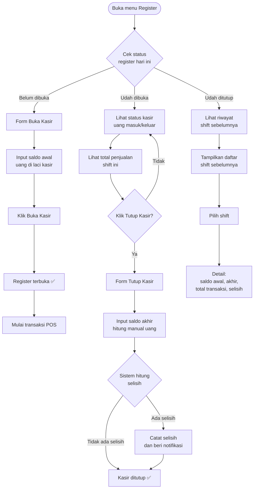
```mermaid
flowchart TD
    START([Buka menu Register]) --> CEK_STATUS{Cek status<br/>register hari ini}

    CEK_STATUS -->|Belum dibuka| FORM_BUKA[Form Buka Kasir]
    CEK_STATUS -->|Udah dibuka| LIHAT_STATUS[Lihat status kasir<br/>uang masuk/keluar]
    CEK_STATUS -->|Udah ditutup| LIHAT_HISTORY[Lihat riwayat<br/>shift sebelumnya]

    FORM_BUKA --> INPUT_SALDO[Input saldo awal<br/>uang di laci kasir]
    INPUT_SALDO --> SUBMIT_BUKA[Klik Buka Kasir]
    SUBMIT_BUKA --> BUKA_BERHASIL[Register terbuka ✅]
    BUKA_BERHASIL --> TRANSAKSI[Mulai transaksi POS]

    LIHAT_STATUS --> HITUNG[Lihat total penjualan<br/>shift ini]
    HITUNG --> TUTUP{Klik Tutup Kasir?}
    TUTUP -->|Ya| FORM_TUTUP[Form Tutup Kasir]
    TUTUP -->|Tidak| LIHAT_STATUS

    FORM_TUTUP --> INPUT_SALDO_AKHIR[Input saldo akhir<br/>hitung manual uang]
    INPUT_SALDO_AKHIR --> HITUNG_SELISIH{Sistem hitung<br/>selisih}
    HITUNG_SELISIH -->|Tidak ada selisih| TUTUP_OK[Kasir ditutup ✅]
    HITUNG_SELISIH -->|Ada selisih| SELISIH[Catat selisih<br/>dan beri notifikasi]
    SELISIH --> TUTUP_OK

    LIHAT_HISTORY --> TAMPIL_LIST[Tampilkan daftar<br/>shift sebelumnya]
    TAMPIL_LIST --> PILIH_SHIFT[Pilih shift]
    PILIH_SHIFT --> DETIL_SHIFT[Detail:<br/>saldo awal, akhir,<br/>total transaksi, selisih]
```

---

### 5.5 Kelola Toko — CRUD Lokasi

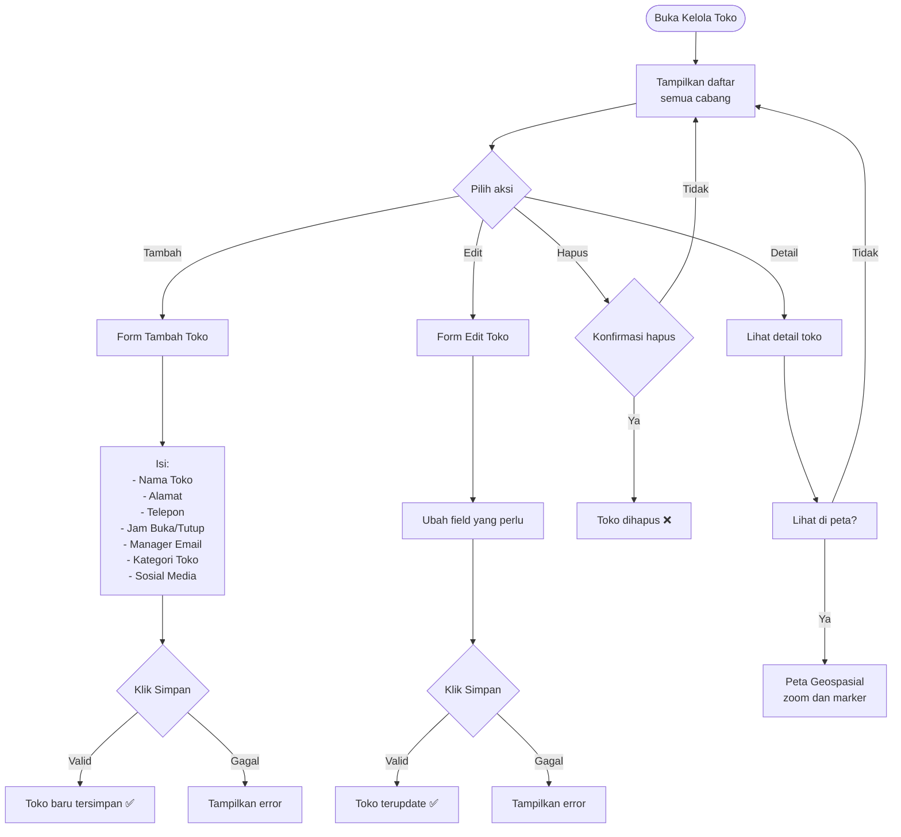
```mermaid
flowchart TD
    START([Buka Kelola Toko]) --> LIST[Tampilkan daftar<br/>semua cabang]

    LIST --> OPSI{Pilih aksi}

    OPSI -->|Tambah| TAMBAH[Form Tambah Toko]
    OPSI -->|Edit| EDIT[Form Edit Toko]
    OPSI -->|Detail| DETAIL[Lihat detail toko]
    OPSI -->|Hapus| HAPUS{Konfirmasi hapus}

    TAMBAH --> INPUT_FIELDS[Isi:<br/>- Nama Toko<br/>- Alamat<br/>- Telepon<br/>- Jam Buka/Tutup<br/>- Manager Email<br/>- Kategori Toko<br/>- Sosial Media]
    INPUT_FIELDS --> SAVE_TAMBAH{Klik Simpan}
    SAVE_TAMBAH -->|Valid| SUCCESS_TAMBAH[Toko baru tersimpan ✅]
    SAVE_TAMBAH -->|Gagal| ERROR_TAMBAH[Tampilkan error]

    EDIT --> EDIT_FIELDS[Ubah field yang perlu]
    EDIT_FIELDS --> SAVE_EDIT{Klik Simpan}
    SAVE_EDIT -->|Valid| SUCCESS_EDIT[Toko terupdate ✅]
    SAVE_EDIT -->|Gagal| ERROR_EDIT[Tampilkan error]

    HAPUS -->|Ya| HAPUS_OK[Toko dihapus ❌]
    HAPUS -->|Tidak| LIST

    DETAIL --> PETA[Lihat di peta?]
    PETA -->|Ya| MAP[Peta Geospasial<br/>zoom dan marker]
    PETA -->|Tidak| LIST
```

---

### 5.6 Produk & Kategori — CRUD Detail

#### 5.6.1 Kategori

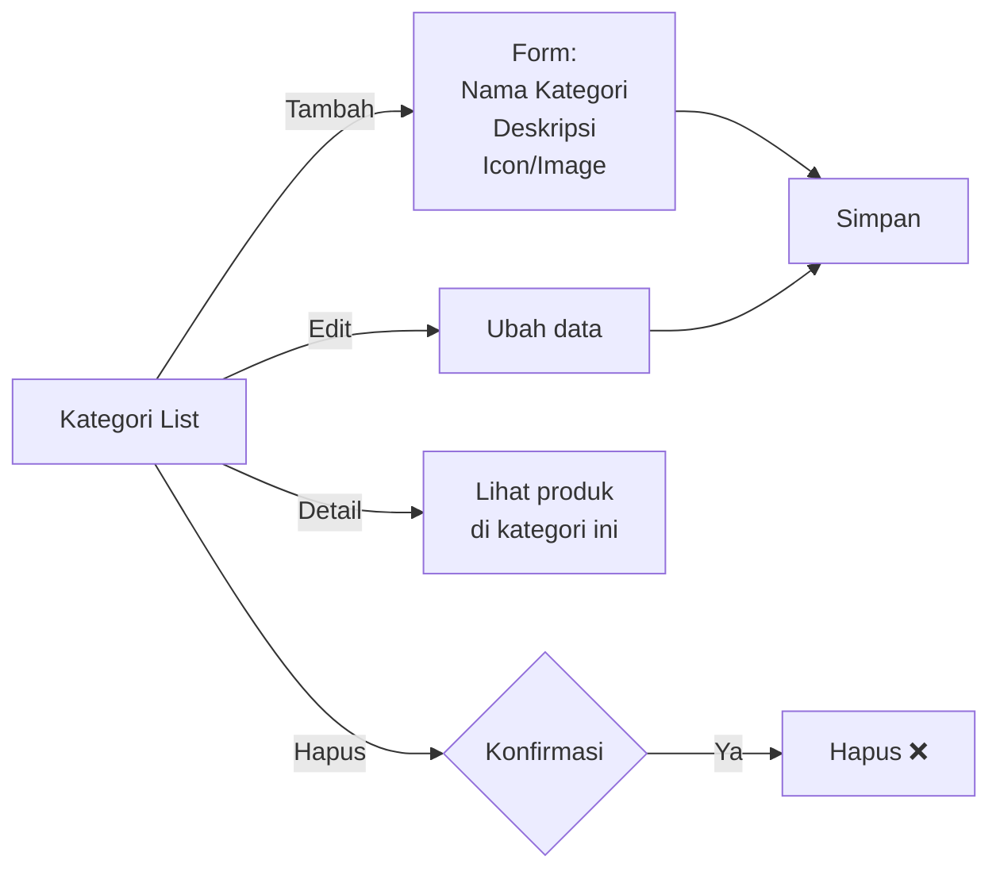
```mermaid
flowchart LR
    LIST_CAT[Kategori List] -->|Tambah| ADD_CAT[Form:<br/>Nama Kategori<br/>Deskripsi<br/>Icon/Image]
    LIST_CAT -->|Edit| EDIT_CAT[Ubah data]
    LIST_CAT -->|Detail| DETAIL_CAT[Lihat produk<br/>di kategori ini]
    LIST_CAT -->|Hapus| DEL_CAT{Konfirmasi}
    ADD_CAT --> SAVE_CAT[Simpan]
    EDIT_CAT --> SAVE_CAT
    DEL_CAT -->|Ya| DELETE_CAT[Hapus ❌]
```

#### 5.6.2 Produk

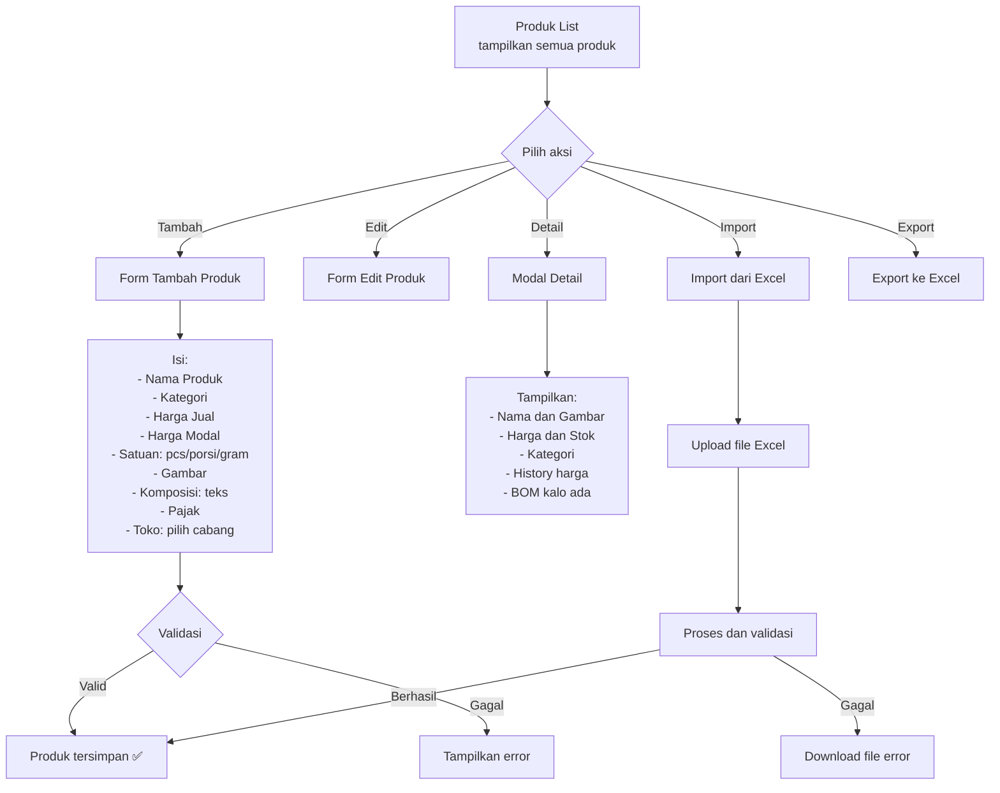
```mermaid
flowchart TD
    LIST_PROD[Produk List<br/>tampilkan semua produk] --> OPSI_PROD{Pilih aksi}

    OPSI_PROD -->|Tambah| ADD_PROD[Form Tambah Produk]
    OPSI_PROD -->|Edit| EDIT_PROD[Form Edit Produk]
    OPSI_PROD -->|Detail| DETAIL_PROD[Modal Detail]
    OPSI_PROD -->|Import| IMPORT_PROD[Import dari Excel]
    OPSI_PROD -->|Export| EXPORT_PROD[Export ke Excel]

    ADD_PROD --> FORM_PROD[Isi:<br/>- Nama Produk<br/>- Kategori<br/>- Harga Jual<br/>- Harga Modal<br/>- Satuan: pcs/porsi/gram<br/>- Gambar<br/>- Komposisi: teks<br/>- Pajak<br/>- Toko: pilih cabang]
    FORM_PROD --> VALID_PROD{Validasi}
    VALID_PROD -->|Valid| SAVE_PROD[Produk tersimpan ✅]
    VALID_PROD -->|Gagal| ERR_PROD[Tampilkan error]

    DETAIL_PROD --> SHOW_DETIL[Tampilkan:<br/>- Nama dan Gambar<br/>- Harga dan Stok<br/>- Kategori<br/>- History harga<br/>- BOM kalo ada]

    IMPORT_PROD --> UPLOAD[Upload file Excel]
    UPLOAD --> PROSES_IMPORT[Proses dan validasi]
    PROSES_IMPORT -->|Berhasil| SAVE_PROD
    PROSES_IMPORT -->|Gagal| ERR_IMPORT[Download file error]
```

---

### 5.7 Pengadaan (Procurement) — Diagram Detail

#### 5.7.1 Supplier

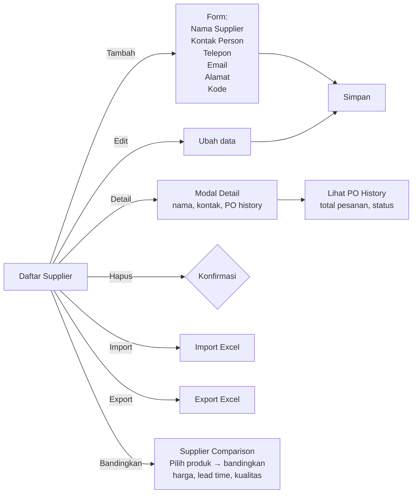
```mermaid
flowchart LR
    LIST_SUPP[Daftar Supplier] -->|Tambah| ADD_SUPP[Form:<br/>Nama Supplier<br/>Kontak Person<br/>Telepon<br/>Email<br/>Alamat<br/>Kode]
    LIST_SUPP -->|Edit| EDIT_SUPP[Ubah data]
    LIST_SUPP -->|Detail| DETAIL_SUPP[Modal Detail<br/>nama, kontak, PO history]
    LIST_SUPP -->|Hapus| DEL_SUPP{Konfirmasi}
    LIST_SUPP -->|Import| IMP_SUPP[Import Excel]
    LIST_SUPP -->|Export| EXP_SUPP[Export Excel]
    LIST_SUPP -->|Bandingkan| COMPARE[Supplier Comparison<br/>Pilih produk → bandingkan<br/>harga, lead time, kualitas]
    ADD_SUPP --> SAVE_SUPP[Simpan]
    EDIT_SUPP --> SAVE_SUPP
    DETAIL_SUPP --> PO_HIST[Lihat PO History<br/>total pesanan, status]
```

**Data Produk per Supplier:**

| Field             | Fungsi                                                                 |
| ----------------- | ---------------------------------------------------------------------- |
| **Nama Produk**   | Nama produk yang disupplier                                            |
| **Harga**         | Harga beli dari supplier ini                                           |
| **Lead Time**     | Estimasi hari pengiriman dari supplier                                 |
| **Quality Rating**| Rating kualitas (1-5), diisi dari review internal                      |
| **Min Order Qty** | Jumlah minimal pesanan dari supplier ini                                |
| **Last Price**    | Harga terakhir yang pernah dibeli (otomatis dari PO terakhir)         |

#### 5.7.2 Kategori Bahan Baku & Bahan Baku

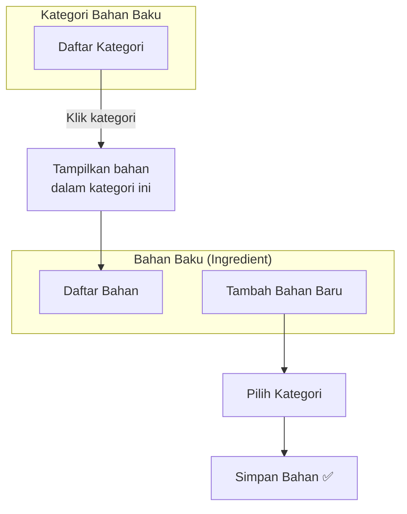
```mermaid
flowchart TD
    subgraph KATEGORI["Kategori Bahan Baku"]
        KAT_LIST["Daftar Kategori"]
    end

    subgraph BAHAN["Bahan Baku (Ingredient)"]
        BAHAN_LIST["Daftar Bahan"]
        BAHAN_ADD["Tambah Bahan Baru"]
    end

    KAT_LIST -->|Klik kategori| FILTER_BY_KAT["Tampilkan bahan<br/>dalam kategori ini"]
    FILTER_BY_KAT --> BAHAN_LIST
    BAHAN_ADD --> KAT_PILIH["Pilih Kategori"]
    KAT_PILIH --> BAHAN_SAVE["Simpan Bahan ✅"]
```

#### 5.7.3 Purchase Order — Alur CRUD Lengkap

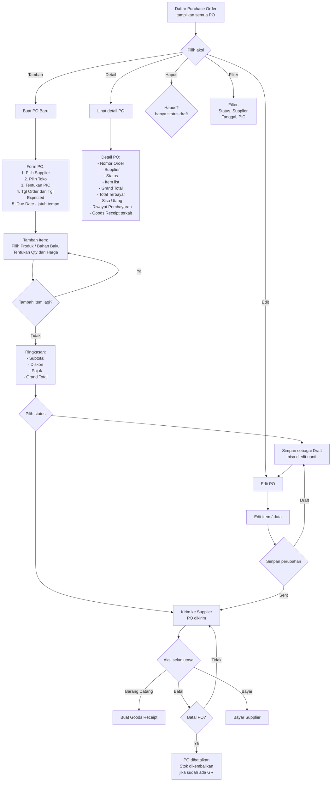
```mermaid
flowchart TD
    PO_LIST[Daftar Purchase Order<br/>tampilkan semua PO] --> OPSI_PO{Pilih aksi}

    OPSI_PO -->|Tambah| PO_ADD[Buat PO Baru]
    OPSI_PO -->|Edit| PO_EDIT[Edit PO]
    OPSI_PO -->|Detail| PO_DETAIL[Lihat detail PO]
    OPSI_PO -->|Hapus| PO_DEL{Hapus?<br/>hanya status draft}
    OPSI_PO -->|Filter| PO_FILTER[Filter:<br/>Status, Supplier,<br/>Tanggal, PIC]

    PO_ADD --> FORM_PO[Form PO:<br/>1. Pilih Supplier<br/>2. Pilih Toko<br/>3. Tentukan PIC<br/>4. Tgl Order dan Tgl Expected<br/>5. Due Date - jatuh tempo]
    FORM_PO --> ITEM_PO[Tambah Item:<br/>Pilih Produk / Bahan Baku<br/>Tentukan Qty dan Harga]

    ITEM_PO --> TAMBAH_ITEM{Tambah item lagi?}
    TAMBAH_ITEM -->|Ya| ITEM_PO
    TAMBAH_ITEM -->|Tidak| RINGKASAN_PO[Ringkasan:<br/>- Subtotal<br/>- Diskon<br/>- Pajak<br/>- Grand Total]

    RINGKASAN_PO --> STATUS_AWAL{Pilih status}
    STATUS_AWAL --> DRAFT[Simpan sebagai Draft<br/>bisa diedit nanti]
    STATUS_AWAL --> SENT[Kirim ke Supplier<br/>PO dikirim]

    DRAFT --> PO_EDIT
    PO_EDIT --> EDIT_FORM[Edit item / data]
    EDIT_FORM --> SIMPAN_EDIT{Simpan perubahan}
    SIMPAN_EDIT -->|Draft| DRAFT
    SIMPAN_EDIT -->|Sent| SENT

    SENT --> AKSI_SENT{Aksi selanjutnya}
    AKSI_SENT -->|Barang Datang| BUAT_GR[Buat Goods Receipt]
    AKSI_SENT -->|Batal| CANCEL_PO{Batal PO?}
    AKSI_SENT -->|Bayar| BAYAR_PO[Bayar Supplier]

    CANCEL_PO -->|Ya| CANCEL_PROSES[PO dibatalkan<br/>Stok dikembalikan<br/>jika sudah ada GR]
    CANCEL_PO -->|Tidak| SENT

    PO_DETAIL --> TAMPIL_DETAIL[Detail PO:<br/>- Nomor Order<br/>- Supplier<br/>- Status<br/>- Item list<br/>- Grand Total<br/>- Total Terbayar<br/>- Sisa Utang<br/>- Riwayat Pembayaran<br/>- Goods Receipt terkait]
```

#### 5.7.4 Riwayat Pembayaran — Catat Pembayaran Supplier

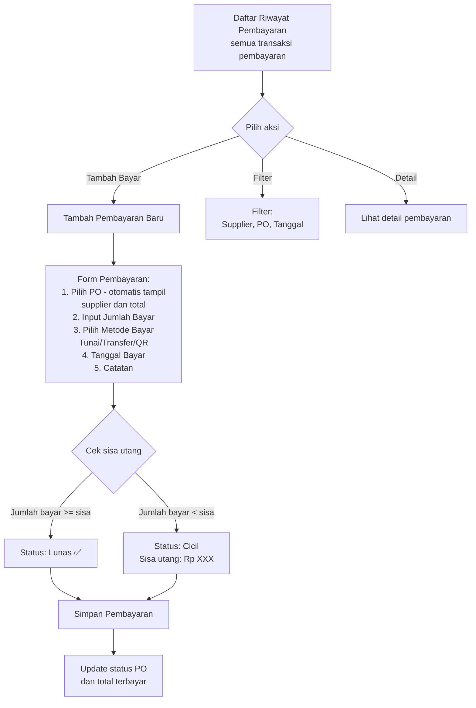
```mermaid
flowchart TD
    PAY_LIST[Daftar Riwayat Pembayaran<br/>semua transaksi pembayaran] --> OPSI_PAY{Pilih aksi}

    OPSI_PAY -->|Tambah Bayar| ADD_PAY[Tambah Pembayaran Baru]
    OPSI_PAY -->|Filter| PAY_FILTER[Filter:<br/>Supplier, PO, Tanggal]
    OPSI_PAY -->|Detail| PAY_DETAIL[Lihat detail pembayaran]

    ADD_PAY --> FORM_PAY[Form Pembayaran:<br/>1. Pilih PO - otomatis tampil<br/>   supplier dan total<br/>2. Input Jumlah Bayar<br/>3. Pilih Metode Bayar<br/>   Tunai/Transfer/QR<br/>4. Tanggal Bayar<br/>5. Catatan]

    FORM_PAY --> CEK_SISA{Cek sisa utang}
    CEK_SISA -->|Jumlah bayar >= sisa| LUNAS[Status: Lunas ✅]
    CEK_SISA -->|Jumlah bayar < sisa| CICIL[Status: Cicil<br/>Sisa utang: Rp XXX]

    LUNAS --> SAVE_PAY[Simpan Pembayaran]
    CICIL --> SAVE_PAY
    SAVE_PAY --> PO_UPDATE[Update status PO<br/>dan total terbayar]
```

---

### 5.8 Pelanggan — Member & Tier

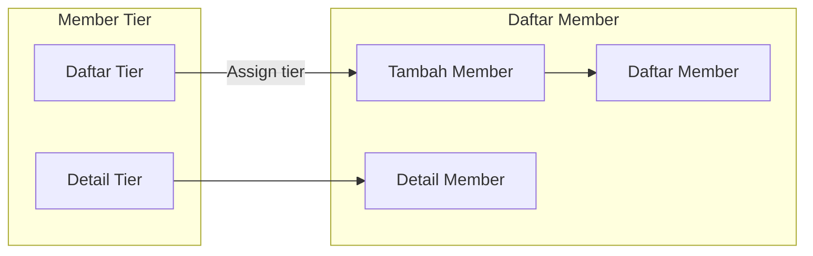
```mermaid
flowchart LR
    subgraph TIER["Member Tier"]
        TIER_LIST["Daftar Tier"]
        TIER_DETAIL["Detail Tier"]
    end

    subgraph MEMBER["Daftar Member"]
        MB_ADD["Tambah Member"]
        MB_LIST["Daftar Member"]
        MB_DETAIL["Detail Member"]
    end

    TIER_LIST -->|Assign tier| MB_ADD
    MB_ADD --> MB_LIST
    TIER_DETAIL --> MB_DETAIL
```

---

### 5.9 Karyawan — Departemen, Posisi, Karyawan, Shift

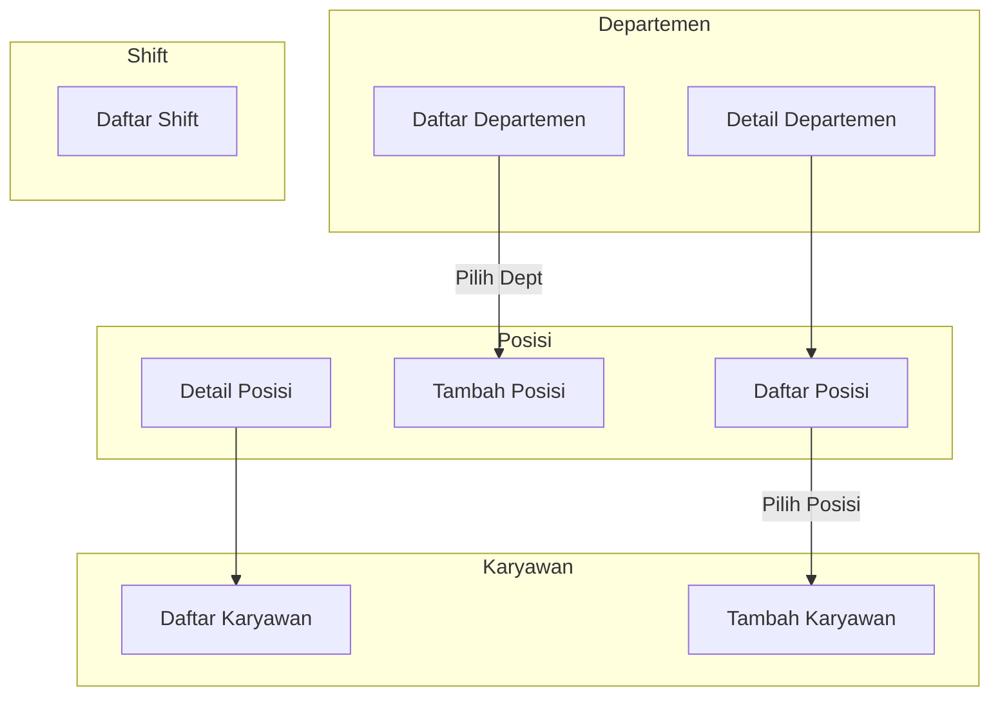
```mermaid
flowchart TD
    subgraph DEPT["Departemen"]
        D_LIST["Daftar Departemen"]
        D_DETAIL["Detail Departemen"]
    end

    subgraph POSISI["Posisi"]
        P_LIST["Daftar Posisi"]
        P_ADD["Tambah Posisi"]
        P_DETIL["Detail Posisi"]
    end

    subgraph KARYAWAN["Karyawan"]
        K_LIST["Daftar Karyawan"]
        K_ADD["Tambah Karyawan"]
    end

    subgraph SHIFT["Shift"]
        S_LIST["Daftar Shift"]
    end

    D_LIST -->|Pilih Dept| P_ADD
    P_LIST -->|Pilih Posisi| K_ADD
    D_DETAIL --> P_LIST
    P_DETIL --> K_LIST
```

---

### 5.10 Manajemen Stok — Diagram Detail

#### 5.10.1 Stock Opname — Hitung Stok Fisik

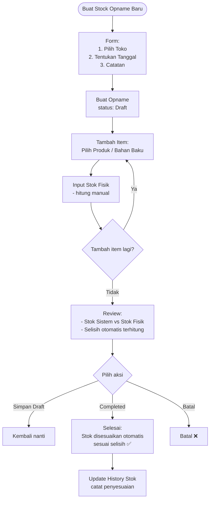
```mermaid
flowchart TD
    START([Buat Stock Opname Baru]) --> FORM_SO[Form:<br/>1. Pilih Toko<br/>2. Tentukan Tanggal<br/>3. Catatan]

    FORM_SO --> BUAT[Buat Opname<br/>status: Draft]
    BUAT --> ITEM_SO[Tambah Item:<br/>Pilih Produk / Bahan Baku]
    ITEM_SO --> INPUT_STOK[Input Stok Fisik<br/>- hitung manual]
    INPUT_STOK --> TAMBAH_SO{Tambah item lagi?}
    TAMBAH_SO -->|Ya| ITEM_SO
    TAMBAH_SO -->|Tidak| REVIEW_SO[Review:<br/>- Stok Sistem vs Stok Fisik<br/>- Selisih otomatis terhitung]

    REVIEW_SO --> STATUS_SO{Pilih aksi}
    STATUS_SO -->|Simpan Draft| DRAFT_SO[Kembali nanti]
    STATUS_SO -->|Completed| COMPLETE_SO[Selesai:<br/>Stok disesuaikan otomatis<br/>sesuai selisih ✅]
    STATUS_SO -->|Batal| CANCEL_SO[Batal ❌]

    COMPLETE_SO --> HISTORY_STOK[Update History Stok<br/>catat penyesuaian]
```

#### 5.10.2 Low Stock & History Stok

```mermaid
flowchart LR
    subgraph LOW["Low Stock Alert"]
        LOW_LIST["Daftar Stok Menipis"]
        BUAT_PO["Buat PO dari sini"]
    end

    subgraph HISTORY["History Stok"]
        HIST_LIST["Riwayat Mutasi Stok"]
    end

    BUAT_PO -->|Redirect| PO_ADD["Form PO baru<br/>dengan produk terisi"]
```

#### 5.10.3 Kitchen Display System (KDS) — Dapur

```mermaid
flowchart TD
    START([Dapur buka layar KDS]) --> TUNGGU[Menunggu order baru<br/>real-time via socket]

    TUNGGU --> ORDER_MASUK{Ada order baru?}
    ORDER_MASUK -->|Ya| NOTIF[Notifikasi suara + visual<br/>Order baru muncul]
    ORDER_MASUK -->|Tidak| TUNGGU

    NOTIF --> LIHAT_ORDER[Tampilkan:<br/>- Nomor Meja / Takeaway<br/>- Daftar Produk dan Qty<br/>- Catatan Khusus<br/>- Waktu Order]

    LIHAT_ORDER --> PROSES{Koki mulai proses}
    PROSES --> SELESAI_MASAK[Masak selesai]
    SELESAI_MASAK --> Klik_Selesai[Klik Siap Saji]
    Klik_Selesai --> PAKAI_STATUS[Status berubah: Siap Saji ✅]

    PAKAI_STATUS --> WAITRESS[Pelayan/Waitress<br/>lihat status dan antar]
```

#### 5.10.4 BOM (Bill of Materials) — Resep Produk

```mermaid
flowchart TD
    BOM_LIST[Daftar BOM] -->|Tambah| BOM_ADD[Form BOM Baru]
    BOM_LIST -->|Detail| BOM_DETAIL[Lihat detail BOM]
    BOM_LIST -->|Hapus| BOM_DEL{Konfirmasi hapus}

    BOM_ADD --> FORM_BOM[Isi:<br/>1. Nama BOM<br/>2. Pilih Produk Jadi<br/>3. Qty Produk Jadi]
    FORM_BOM --> BOM_ITEM[Tambah Bahan:<br/>1. Pilih Ingredient<br/>2. Input Qty<br/>3. Pilih Unit]

    BOM_ITEM --> TAMBAH_BOM_ITEM{Tambah bahan lagi?}
    TAMBAH_BOM_ITEM -->|Ya| BOM_ITEM
    TAMBAH_BOM_ITEM -->|Tidak| SAVE_BOM[Simpan BOM ✅]

    BOM_DETAIL --> TAMPIL_BOM[Tampilkan:<br/>- Produk: Nasi Goreng<br/>- Bahan:<br/>  • Nasi 200gr<br/>  • Bawang 3 siung<br/>  • Telur 1 butir<br/>- Total biaya bahan]

    TAMPIL_BOM -->|Gunakan di Produksi| KE_PO[Redirect ke<br/>Production Order]
```

#### 5.10.5 Production Order — Produksi Barang

```mermaid
flowchart TD
    PO_LIST_PROD[Daftar Production Order] -->|Tambah| PO_ADD_PROD[Form PO Produksi]
    PO_LIST_PROD -->|Detail| PO_DETAIL_PROD[Detail PO Produksi]

    PO_ADD_PROD --> FORM_PO_PROD[Isi:<br/>1. Pilih Produk Jadi<br/>2. Qty Produksi<br/>3. Pilih Toko<br/>4. Tanggal Produksi<br/>5. Catatan]

    FORM_PO_PROD --> CEK_BOM{Apakah produk<br/>punya BOM?}
    CEK_BOM -->|Ya| HITUNG_BAHAN[Hitung kebutuhan bahan<br/>- qty dikali BOM]
    CEK_BOM -->|Tidak| MANUAL_INPUT[Input manual<br/>bahan yang dipakai]

    HITUNG_BAHAN --> CEK_STOK_PROD{Cek stok bahan<br/>di gudang}
    CEK_STOK_PROD -->|Cukup| BUAT_PO_PROD[Buat Production Order<br/>status: In Progress]
    CEK_STOK_PROD -->|Kurang| NOTIF_KURANG[Notifikasi:<br/>Bahan tidak cukup!<br/>- Nasi: butuh 10kg, stok 2kg<br/>- Bawang: butuh 100, stok 20]

    NOTIF_KURANG --> BELI_BAHAN{Beli bahan<br/>sekarang?}
    BELI_BAHAN -->|Ya| PO_REDIRECT[Redirect ke<br/>Purchase Order baru]
    BELI_BAHAN -->|Tidak| BUAT_PO_PROD

    BUAT_PO_PROD --> PROSES_PRODUKSI[Produksi berjalan]
    PROSES_PRODUKSI --> SELESAI_PROD{Produksi selesai}
    SELESAI_PROD -->|Klik Selesai| SELESAI_PROD_OK[Production Order Completed ✅]

    SELESAI_PROD_OK --> UPDATE_STOK[Update stok otomatis:<br/>+ Stok Barang Jadi<br/>- Stok Bahan Baku]
    UPDATE_STOK --> HISTORY_STOK2[Catat di History Stok]
```

#### 5.10.6 Goods Receipt — Terima Barang dari PO

```mermaid
flowchart TD
    GR_LIST[Daftar Goods Receipt] -->|Tambah| GR_ADD[Buat GR Baru]
    GR_LIST -->|Detail| GR_DETAIL[Lihat detail GR]
    GR_LIST -->|Edit| GR_EDIT[Edit GR<br/>hanya status draft]
    GR_LIST -->|Batal| GR_CANCEL{Batal GR?}

    GR_ADD --> FORM_GR[Form GR:<br/>1. Pilih Purchase Order<br/>   - otomatis ambil supplier<br/>2. Pilih Toko<br/>3. Tanggal Terima<br/>4. Catatan]

    FORM_GR --> PILIH_PO{PO dipilih}
    PILIH_PO -->|PO ditemukan| LOAD_ITEMS[Load item dari PO<br/>- Produk / Ingredient<br/>- Qty PO<br/>- Qty Received]

    LOAD_ITEMS --> INPUT_QTY[Input qty yg diterima<br/>+ kondisi barang]
    INPUT_QTY --> CEK_QTY{Apakah semua<br/>qty sesuai?}
    CEK_QTY -->|Sesuai| STATUS_OK[Status Item: OK]
    CEK_QTY -->|Kurang| STATUS_KURANG[Status Item:<br/>Partial / Kurang]
    CEK_QTY -->|Rusak| STATUS_RUSAK[Konfirmasi retur<br/>dan buat Purchase Return]

    STATUS_OK --> REVIEW_GR[Review GR]
    STATUS_KURANG --> REVIEW_GR
    STATUS_RUSAK --> REVIEW_GR

    REVIEW_GR --> SIMPAN_GR{Pilih aksi}
    SIMPAN_GR -->|Draft| GR_DRAFT[Simpan draft<br/>bisa diedit]
    SIMPAN_GR -->|Completed| GR_COMPLETE[GR Completed ✅]
    SIMPAN_GR -->|Batal| GR_CANCEL

    GR_COMPLETE --> ADD_STOCK_GR[Tambah stok:<br/>Produk / Ingredient]
    ADD_STOCK_GR --> HISTORY_STOK_GR[Catat History Stok]
    HISTORY_STOK_GR --> UPDATE_PO_STATUS[Update PO status<br/>ke Completed<br/>jika semua item lengkap]

    GR_CANCEL -->|Konfirmasi| GR_CANCEL_OK[GR Dibatalkan ❌<br/>Stok dikembalikan<br/>ke semula]
    GR_DETAIL --> TAMPIL_GR_DETAIL[Tampilkan:<br/>- Nomor GR<br/>- Supplier / PO<br/>- Item diterima<br/>- Status]
```

#### 5.10.7 Sales Return — Retur dari Pelanggan

```mermaid
flowchart LR
    SR_LIST[Daftar Sales Return] -->|Tambah| SR_ADD[Form Sales Return]
    SR_LIST -->|Detail| SR_DETAIL[Lihat detail]

    SR_ADD --> FORM_SR[Isi:<br/>1. Cari transaksi asal<br/>2. Pilih produk diretur<br/>3. Qty dan Alasan<br/>4. Total Refund<br/>5. Tanggal Retur]

    FORM_SR --> SAVE_SR[Simpan ✅]
    SAVE_SR --> UPDATE_STOK_SR[Stok kembali +<br/>Catat History]
```

#### 5.10.8 Purchase Return — Retur ke Supplier

```mermaid
flowchart LR
    PR_LIST[Daftar Purchase Return] -->|Tambah| PR_ADD[Form Purchase Return]
    PR_LIST -->|Detail| PR_DETAIL[Lihat detail]

    PR_ADD --> FORM_PR[Isi:<br/>1. Pilih Purchase Order<br/>2. Pilih item diretur<br/>3. Qty dan Alasan<br/>4. Harga refund<br/>5. Tanggal Retur]

    FORM_PR --> SAVE_PR[Simpan ✅]
    SAVE_PR --> UPDATE_STOK_PR[Stok berkurang +<br/>Catat History]
```

#### 5.10.9 Transfer Stok — Antar Cabang

```mermaid
flowchart TD
    TF_LIST[Daftar Transfer Stok] -->|Tambah| TF_ADD[Buat Transfer Baru]
    TF_LIST -->|Detail| TF_DETAIL[Lihat detail]

    TF_ADD --> FORM_TF[Form:<br/>1. Pilih Toko Asal<br/>2. Pilih Toko Tujuan<br/>3. Tanggal Kirim<br/>4. Catatan]

    FORM_TF --> ITEM_TF[Tambah Item:<br/>Pilih Produk dan Qty]
    ITEM_TF --> TAMBAH_TF_ITEM{Tambah lagi?}
    TAMBAH_TF_ITEM -->|Ya| ITEM_TF
    TAMBAH_TF_ITEM -->|Tidak| REVIEW_TF[Review:<br/>- Toko A ke  Toko B<br/>- Daftar barang dan qty]

    REVIEW_TF --> STATUS_TF{Pilih aksi}
    STATUS_TF -->|Draft| TF_DRAFT[Simpan draft]
    STATUS_TF -->|Sent| TF_SENT[Dikirim ✅]

    TF_SENT --> UPDATE_STOK_TF[Update stok:<br/>- Toko Asal: Stok -<br/>- Toko Tujuan: Stok +]
    UPDATE_STOK_TF --> HISTORY_TF[Catat History Stok<br/>di kedua toko]
```

#### 5.10.10 Adjustment Stok — Koreksi Stok Manual

```mermaid
flowchart TD
    ADJ_LIST[Halaman Adjustment Stok] --> PILIH_PRODUK[Pilih Produk<br/>dari daftar produk toko]

    PILIH_PRODUK --> FORM_ADJ[Tentukan:<br/>1. Jenis: Plus / Minus<br/>2. Jumlah Qty<br/>3. Catatan (opsional)]

    FORM_ADJ --> REVIEW_ADJ[Review perubahan:<br/>- Produk: Nama<br/>- Perubahan: +5 / -3<br/>- Catatan]

    REVIEW_ADJ --> KONFIRMASI_ADJ{Konfirmasi<br/>Adjustment?}
    KONFIRMASI_ADJ -->|Ya| UPDATE_STOK_ADJ[Update stok:<br/>- product.stock: ± qty<br/>- product_store_stock: ± qty]
    KONFIRMASI_ADJ -->|Tidak| BATAL_ADJ[Batal]

    UPDATE_STOK_ADJ --> HISTORY_ADJ[Catat History Stok<br/>dengan tipe adjustment]
```

> **Kapan pake ini?** Barang rusak, hilang, kelebihan stok, atau koreksi stok lainnya yang gak lewat penjualan atau pembelian.

---

### 5.11 Laporan — Semua Jenis Laporan

```mermaid
flowchart TD
    REPORT[Dashboard Laporan] --> OPSI_REPORT{Pilih jenis laporan}

    OPSI_REPORT -->|Penjualan| SALES[Laporan Penjualan]
    OPSI_REPORT -->|Produk Terlaris| BEST[Produk Terlaris]
    OPSI_REPORT -->|Laporan Harian| DAILY[Laporan Harian]
    OPSI_REPORT -->|Laba / Rugi| PL[Laba Rugi]
    OPSI_REPORT -->|Arus Kas| CASH[Arus Kas]

    SALES --> FILTER_SALES[Filter:<br/>- Tanggal: start/end<br/>- Toko: pilih cabang<br/>- Kategori Produk]
    FILTER_SALES --> TAMPIL_SALES[Tampilkan:<br/>- Total Omzet<br/>- Jumlah Transaksi<br/>- Rata-rata Transaksi<br/>- Tabel detail per produk]
    TAMPIL_SALES --> EXPORT_SALES{Export?}
    EXPORT_SALES -->|Ya| EXPORT_EXCEL_SALES[Download Excel ✅]

    BEST --> FILTER_BEST[Filter: Tanggal, Toko]
    FILTER_BEST --> TAMPIL_BEST[Tampilkan:<br/>- Ranking produk terlaris<br/>- Qty terjual<br/>- Total omzet per produk]
    TAMPIL_BEST --> EXPORT_BEST{Export?}
    EXPORT_BEST -->|Ya| EXPORT_EXCEL_BEST[Download Excel ✅]

    DAILY --> FILTER_DAILY[Pilih Tanggal dan Toko]
    FILTER_DAILY --> TAMPIL_DAILY[Tampilkan:<br/>- Rekap per jam/transaksi<br/>- Total harian]

    PL --> FILTER_PL[Filter: Periode, Toko]
    FILTER_PL --> HITUNG_PL[Hitung otomatis:<br/>- Total Pendapatan<br/>- Total HPP: modal<br/>- Total Pengeluaran<br/>- Gross Profit<br/>- Net Profit/Loss]
    HITUNG_PL --> TAMPIL_PL[Tampilkan grafik + tabel]

    CASH --> FILTER_CASH[Filter: Periode, Toko]
    FILTER_CASH --> HITUNG_CASH[Hitung:<br/>- Uang Masuk: penjualan<br/>- Uang Keluar: pembayaran,<br/>  pengeluaran, gaji<br/>- Saldo Akhir]
    HITUNG_CASH --> TAMPIL_CASH[Tampilkan grafik arus kas]
```

---

### 5.12 Pengaturan — Fitur Settings Detail

#### 5.12.1 Invoice & Struk

```mermaid
flowchart LR
    INV_PAGE[Halaman Invoice] --> FORM_INV[Atur:<br/>- Logo Toko<br/>- Header Struk<br/>- Footer: terima kasih<br/>- Sosial Media<br/>- Info Kontak<br/>- Tampilkan Member Info<br/>- Tampilkan Logo]
    FORM_INV --> PREVIEW[Preview Struk]
    PREVIEW --> SAVE_INV[Simpan ✅]
    SAVE_INV --> POS_STRUK[Terpakai di POS<br/>waktu cetak struk]
```

#### 5.12.2 Pajak

```mermaid
flowchart LR
    TAX_LIST[Daftar Pajak] -->|Tambah| TAX_ADD[Form:<br/>- Nama Pajak: PPN, dll<br/>- Persentase<br/>- Aktif/Nonaktif]
    TAX_LIST -->|Edit| TAX_EDIT[Ubah data]
    TAX_LIST -->|Hapus| TAX_DEL{Konfirmasi}
    TAX_ADD --> TAX_SAVE[Simpan ✅]
    TAX_EDIT --> TAX_SAVE
    TAX_SAVE --> PO_PRODUK[Terpakai di PO dan Produk]
```

#### 5.12.3 Metode Pembayaran

```mermaid
flowchart LR
    TP_LIST[Daftar Metode Bayar] -->|Tambah| TP_ADD[Form:<br/>Nama: Tunai, QRIS, Kartu<br/>Icon]
    TP_LIST -->|Edit| TP_EDIT[Ubah data]
    TP_LIST -->|Detail| TP_DETAIL[Lihat detail]
    TP_ADD --> TP_SAVE[Simpan ✅]
    TP_EDIT --> TP_SAVE
    TP_SAVE --> POS_BAYAR[Terpakai di POS<br/>dan pembayaran supplier]
```

#### 5.12.4 Role & Izin

```mermaid
flowchart TD
    ROLE_LIST[Manajemen Role] -->|Tambah| ROLE_ADD[Form:<br/>- Nama Role: Admin, Kasir, dll]
    ROLE_LIST -->|Edit| ROLE_EDIT[Akses Menu dan Izin]
    ROLE_LIST -->|Detail| ROLE_DETAIL[Lihat akses role]

    ROLE_ADD --> SAVE_ROLE[Role baru ✅]

    ROLE_EDIT --> EDIT_PERMISSION[Atur izin per menu:<br/>- View : boleh lihat<br/>- Add : boleh tambah<br/>- Edit : boleh ubah<br/>- Delete : boleh hapus]
    EDIT_PERMISSION --> SAVE_PERMISSION[Simpan izin ✅]
    SAVE_PERMISSION --> USER_APPLY[Berlaku untuk semua<br/>user dengan role ini]
```

#### 5.12.5 Harga per Toko

```mermaid
flowchart LR
    PRICE_LIST[Daftar Template Harga] -->|Tambah/Edit| PRICE_FORM[Pilih Produk dan Toko<br/>Atur harga jual khusus]
    PRICE_FORM --> SAVE_PRICE[Simpan ✅]
    SAVE_PRICE --> POS_HARGA[POS pakai harga<br/>sesuai toko]
```

#### 5.12.6 Meja

```mermaid
flowchart TD
    TABLE_LIST[Daftar Meja] -->|Tambah| TABLE_ADD[Form:<br/>- Nomor Meja<br/>- Kapasitas<br/>- Pilih Toko]
    TABLE_LIST -->|Edit| TABLE_EDIT[Ubah data]
    TABLE_LIST -->|Update Status| TABLE_STATUS[Ubah status:<br/>Kosong / Terisi / Reservasi]
    TABLE_LIST -->|QR Code| TABLE_QR[Generate QR Code<br/>untuk customer order]

    TABLE_ADD --> SAVE_TABLE[Simpan ✅]
    TABLE_EDIT --> SAVE_TABLE
    TABLE_QR --> PRINT_QR[Download / Cetak QR]
    PRINT_QR --> TEMPEL[Tempel di meja]
    TEMPEL --> CUST_ORDER[Pelanggan scan QR<br/>dan order sendiri]
```

---

### 5.13 Summary: Kapan Pake Fitur Apa?

| Situasi                             | Fitur yang Dipake                        |
| ----------------------------------- | ---------------------------------------- |
| **Punya cabang baru**               | Kelola Toko → Tambah Lokasi              |
| **Mau jualan produk baru**          | Produk → Tambah Produk                   |
| **Cari supplier barang**            | Pengadaan → Supplier → Tambah            |
| **Stok mau habis**                  | Purchase Order → Tambah PO               |
| **Barang dari supplier datang**     | Goods Receipt → Tambah GR                |
| **Barang supplier rusak**           | Purchase Return                          |
| **Mau bayar supplier**              | Riwayat Pembayaran → Tambah Bayar        |
| **Produksi barang sendiri**         | Production Order → Tambah                |
| **Bikin resep produk**              | BOM → Tambah                             |
| **Cek stok fisik**                  | Stock Opname                             |
| **Transfer barang ke cabang lain**  | Transfer Stok                            |
| **Koreksi stok manual**            | Adjustment Stok                          |
| **Pelanggan mau daftar member**     | Pelanggan → Daftar Member                |
| **Kasir baru**                      | Karyawan → Daftar Karyawan + Role        |
| **Buat laporan penjualan**          | Laporan → Penjualan                      |
| **Cek laba/rugi**                   | Laporan → Laba/Rugi                      |
| **Atur tampilan struk**             | Pengaturan → Invoice & Struk             |
| **Buat diskon / promo**             | Transaksi → Diskon                       |
| **Pelanggan bayar nanti (kredit)**  | Piutang Pelanggan (AR)                   |
| **Catat pembayaran piutang**        | AR Payment                               |
| **Tukar poin member dengan produk** | Set harga poin di Produk → Redeem di POS |
| **Pisah bayar per orang**           | Split Bill di POS                        |
| **Kirim notifikasi ke pelanggan**   | WhatsApp notifikasi otomatis             |
| **Tanya soal penggunaan POS**      | FAQ Chat (floating button)               |
| **Analisa performa toko / revenue** | FAQ Chat → ganti mode AI                 |
| **Kirim pesanan ke pelanggan**      | Delivery Order → Assign Driver           |
| **Atur pengiriman internal**        | Delivery Order → Driver Management       |
| **Kelola antrian pelanggan**        | Queue Management → Tambah ke Antrian     |
| **Cek performa supplier**           | Supplier Performance → Hitung Skor       |
| **Bandingkan supplier per produk**  | Supplier Comparison → Pilih Produk       |
| **Buat promo otomatis**             | Promo Campaign → Buat Kampanye           |
| **Jualan di GoFood/GrabFood**       | Marketplace Integration → Produk Mapping |
| **Terima pesanan marketplace**      | Marketplace → Webhook → Delivery Order   |
| **Cek komisi marketplace**          | Marketplace → Commission Tracking        |

---

### 5.14 Customer Order (QR Self-Order) — Pelanggan Order Sendiri

> Fitur ini buat pelanggan **order langsung dari HP** dengan scan QR code di meja. Cocok buat restoran/cafe yang pengen kurangi antrian & beban waitress.

```mermaid
flowchart TD
    START([Pelanggan duduk<br/>di meja]) --> SCAN[Scan QR Code<br/>di meja]

    SCAN --> BUKA[Buka halaman Customer Order<br/>di HP pelanggan]
    BUKA --> LIHAT_MENU[Tampilkan menu<br/>sesuai toko ini]
    LIHAT_MENU --> PILIH_PRODUK[Pilih produk<br/>+ tambah qty]
    PILIH_PRODUK --> CATATAN{Tambah catatan?}
    CATATAN -->|Ya| INPUT_NOTE[Input catatan<br/>misal: kurang pedas]
    CATATAN -->|Tidak| CEK_LAGI{Pesan lagi?}
    INPUT_NOTE --> CEK_LAGI

    CEK_LAGI -->|Ya| PILIH_PRODUK
    CEK_LAGI -->|Tidak| REVIEW_PESANAN[Review pesanan<br/>+ hitung total]
    REVIEW_PESANAN --> ORDER{Konfirmasi<br/>Pesan?}
    ORDER -->|Ya| KIRIM_ORDER[Pesanan terkirim ✅]
    ORDER -->|Tidak| BATAL_ORDER[Batal<br/>kembali ke menu]

    KIRIM_ORDER --> DAPUR[Pesanan masuk<br/>ke KDS Dapur]
    KIRIM_ORDER --> POS[Pesanan muncul<br/>di POS Kasir]
    DAPUR --> SIAP[Makanan siap]
    SIAP --> WAITRESS[Waitress antar<br/>ke meja]
    POS --> BAYAR[Pelanggan bayar<br/>ke kasir]
```

**Yang perlu kamu tau:**

- Pelanggan **gak perlu login** — cukup scan QR
- Pesanan otomatis masuk ke **KDS dapur** & **POS kasir**
- Kasir tinggal finalisasi pembayaran pas pelanggan mau bayar
- Cocok buat **mengurangi antrian** & **meningkatkan throughput**

---

### 5.15 Reservasi Meja

> Fitur booking meja. Pelanggan bisa reservasi duluan, dateng tinggal duduk. Biar meja gak keburu keambil & operasional lebih terprediksi.

```mermaid
flowchart TD
    RES_LIST[Daftar Reservasi] -->|Tambah| RES_ADD[Buat Reservasi Baru]
    RES_LIST -->|Edit| RES_EDIT[Edit Reservasi]
    RES_LIST -->|Detail| RES_DETAIL[Halaman Detail Reservasi]

    RES_ADD --> FORM_RES[Form Reservasi:<br/>1. Pilih Toko<br/>2. Pilih Tanggal & Jam<br/>3. Pilih Meja: lihat ketersediaan<br/>4. Nama Pelanggan<br/>5. Jumlah Orang<br/>6. No Telepon & Email<br/>7. Catatan]

    FORM_RES --> CEK_MEJA{Cek ketersediaan<br/>meja}
    CEK_MEJA -->|Tersedia| TERSEDIA[Meja tersedia ✅]
    CEK_MEJA -->|Terbooking| SARAN_MEJA[Sarankan meja lain<br/>atau jam alternatif]
    SARAN_MEJA --> FORM_RES

    TERSEDIA --> SAVE_RES[Simpan Reservasi<br/>status: Pending]

    SAVE_RES --> KONFIRMASI_DULU{Dari daftar,<br/>klik Confirm ✅}
    KONFIRMASI_DULU --> MODAL_KONFIR[Muncul modal konfirmasi]
    MODAL_KONFIR -->|Ya| STATUS_JADI[Status: Confirmed<br/>Meja otomatis: Reserved]

    RES_LIST -->|Klik Cancel ❌| MODAL_BATAL[Muncul modal batalkan]
    MODAL_BATAL -->|Ya| STATUS_BATAL[Status: Cancelled<br/>Meja otomatis: Available]

    RES_LIST -->|Klik Detail 👁️| RES_DETAIL

    RES_DETAIL --> TAMPIL_RES[Halaman Detail:<br/>- Nama, Telepon, Email<br/>- Tanggal & Jam<br/>- Nama Meja & Toko<br/>- Jumlah Orang & Catatan<br/>- Status & Audit Trail<br/>- Tombol Kirim WA]

    TAMPIL_RES -->|Klik Kirim WA| WA_BUKA[WA otomatis terbuka<br/>dengan pesan konfirmasi<br/>ke nomor pelanggan]

    %% Update status dari Table List
    TABEL_LIST[Halaman Table List] -->|Klik Set Available 🔄| MODAL_AVAIL[Muncul modal<br/>Set Meja Tersedia]
    MODAL_AVAIL -->|Ya| TABEL_AVAIL[Meja: Available<br/>Reservasi: Completed ✅]

    NOTIF_RES --> DATANG{Ketika pelanggan<br/>datang}
    DATANG --> UPDATE_STATUS[Update status:<br/>Selesai / No Show]

    RES_EDIT --> FORM_EDIT[Ubah data reservasi]
    FORM_EDIT --> SAVE_EDIT[Simpan perubahan ✅]
```

**Yang perlu kamu tau:**

- **Cek ketersediaan real-time** — kalau meja udah dibooking, sistem kasih tau
- **Konfirmasi dengan modal** — Confirm & Cancel pakai modal konfirmasi, gak langsung eksekusi
- **WA Confirmation** — dari halaman detail, kirim konfirmasi via WhatsApp ke nomor pelanggan (hanya untuk status Confirmed)
- **Table List terintegrasi** — meja otomatis Reserved saat dikonfirmasi, balik Available saat dibatalkan/dihapus. Admin juga bisa手动 set Available dari Table List
- Status reservasi: Pending → Confirmed (Reserved) → Completed / Cancelled / No Show

---

### 5.16 Pengeluaran (Expenses)

> Catat semua biaya operasional: listrik, air, gas, gaji, dll. Biar tau kemana aja uang pergi & bisa diitung di laporan Laba/Rugi.

```mermaid
flowchart TD
    EXP_LIST[Daftar Pengeluaran] -->|Tambah| EXP_ADD[Tambah Pengeluaran]
    EXP_LIST -->|Edit| EXP_EDIT[Edit]
    EXP_LIST -->|Detail| EXP_DETAIL[Lihat detail]

    EXP_ADD --> FORM_EXP[Form Pengeluaran:<br/>1. Pilih Kategori<br/>   - Listrik, Gas, Gaji, dll<br/>2. Nama Pengeluaran<br/>3. Jumlah<br/>4. Tanggal<br/>5. Toko<br/>6. Catatan / Bukti]
    FORM_EXP --> CEK_APPROVAL{Apakah perlu<br/>approval?}
    CEK_APPROVAL -->|Ya| APPROVAL[Status: Pending Approval]
    CEK_APPROVAL -->|Tidak| SAVE_EXP[Simpan ✅]

    APPROVAL --> APPROVE{Disetujui?}
    APPROVE -->|Ya| SAVE_EXP
    APPROVE -->|Tidak| TOLAK[Ditolak ❌]

    SAVE_EXP --> UPDATE_LAPORAN[Tercatat di:<br/>- Laporan Laba/Rugi<br/>- Laporan Arus Kas]

    EXP_DETAIL --> TAMPIL_EXP[Tampilkan:<br/>- Kategori & Nama<br/>- Jumlah<br/>- Tanggal<br/>- Status: Disetujui / Pending / Ditolak]

    %% Manage categories
    EXP_LIST --> KATEGORI[Lihat Kategori]
    KATEGORI --> KAT_ADD[Tambah Kategori]
    KATEGORI --> KAT_EDIT[Edit Kategori]
```

**Yang perlu kamu tau:**

- Ada **kategori pengeluaran** — tinggal atur sendiri (Listrik, Air, Gas, Gaji, dll)
- Bisa pake **approval flow** — pengeluaran tertentu perlu disetujui dulu
- Semua expense otomatis masuk ke **Laporan Laba/Rugi** & **Arus Kas**

---

### 5.17 FAQ Chat — Tanya Jawab & AI Analisa

> Fitur chatbot interaktif untuk tanya jawab soal penggunaan POS dan analisa bisnis bertemu AI. Ada di pojok kanan bawah sebagai floating button 💬.

```mermaid
flowchart TD
    FAB[Floating Button 💬<br/>pojok kanan bawah] -->|Klik| PANEL[Panel Chat Terbuka]

    PANEL --> PILIH_MODE{Pilih Mode}
    PILIH_MODE -->|Klik FAQ| FAQ_MODE[Mode FAQ]
    PILIH_MODE -->|Klik AI| AI_MODE[Mode AI]

    FAQ_MODE --> TOPIK[Ketik pertanyaan<br/>atau pilih topik cepat]
    FAQ_MODE --> Q_LIST[Daftar topik:<br/>reset password, cetak ulang,<br/>refund, laporan, dll]

    TOPIK --> SEARCH_FAQ[GET /faq?q=...]
    Q_LIST --> SEARCH_FAQ
    SEARCH_FAQ --> HASIL_FAQ[Tampilkan jawaban<br/>dari database FAQ]

    AI_MODE --> TANYA_AI[Ketik pertanyaan<br/>analisa toko]
    TANYA_AI --> POST_AI[POST /faq/ask]
    POST_AI --> GEMINI[Gemini AI proses<br/>data toko]
    GEMINI --> JAWAB_AI[Tampilkan jawaban AI ✅]

    PANEL -->|Klik Escape / luar panel| TUTUP[Panel Tertutup]
```

**Yang perlu kamu tau:**

- **FAQ mode (default):** Jawaban dari database FAQ — cepat, offline-ready, tanpa AI
- **AI mode:** Jawaban pake Gemini AI buat analisa toko (revenue, stok, performa)
- **Tombol AI / FAQ** di pojok kanan atas panel buat ganti mode
- Pencet **Escape** atau klik di luar panel → otomatis nutup
- Bisa pake dari halaman mana aja — floating button selalu ada

---

### 5.18 Delivery Order — Pengiriman Internal

> Fitur kelola pesanan pengiriman dari POS ke pelanggan. Driver internal toko yang antar.

```mermaid
flowchart TD
    START([Pelanggan pesan<br/>via POS / Online]) --> BUAT_DO[Buat Delivery Order]
    BUAT_DO --> FORM_DO[Form:<br/>- Pilih/Isi data pelanggan<br/>- Alamat pengiriman<br/>- No telepon<br/>- Sumber: POS/QR/Manual/Online<br/>- Estimasi waktu<br/>- Catatan]
    FORM_DO --> SIMPAN_DO[Simpan DO<br/>status: Pending]

    SIMPAN_DO --> ASSIGN{Admin assign<br/>driver}
    ASSIGN --> PILIH_DRIVER[Pilih driver<br/>yang available]
    PILIH_DRIVER --> STATUS_ASSIGNED[Status: Assigned<br/>Driver status → Busy]

    STATUS_ASSIGNED --> DRIVER_AMBIL[Driver ambil<br/>barang dari toko]
    DRIVER_AMBIL --> STATUS_PICKED[Status: Picked Up]

    STATUS_PICKED --> STATUS_TRANSIT[Status: In Transit<br/>Driver di jalan]

    STATUS_TRANSIT --> CEK_STATUS{Status pengiriman}
    CEK_STATUS -->|Berhasil| STATUS_DELIVERED[Status: Delivered ✅<br/>Driver status → Active]
    CEK_STATUS -->|Batal| STATUS_CANCELLED[Status: Cancelled ❌<br/>Driver status → Active]

    STATUS_DELIVERED --> SELESAI[Selesai]
    STATUS_CANCELLED --> SELESAI
```

**Yang perlu kamu tau:**

- **Driver auto-manage status**: active → busy saat assign, busy → active saat delivery selesai/dibatalkan
- **Status tracking real-time** via Socket.IO — semua perubahan tercatat di history
- **Sumber pesanan**: bisa dari POS langsung, QR order, manual admin, atau online
- **Stats dashboard**: total pesanan, pending, assigned, in transit, delivered, cancelled

---

### 5.19 Queue Management — Antrian Pelanggan

> Fitur antrian pelanggan untuk restoran/kafe. Pelanggan kasih nama, sistem urutkan otomatis berdasarkan prioritas.

```mermaid
flowchart TD
    START([Pelanggan datang<br/>tanpa reservasi]) --> TAMBAH[Tambah ke Antrian]
    TAMBAH --> FORM_Q[Form:<br/>- Nama Pelanggan<br/>- Jumlah Orang<br/>- Prioritas: Normal/VPN/Pregnant/Elderly/Disabled<br/>- Catatan]
    FORM_Q --> AUTO_NUM[Nomor antrian<br/>auto-generate<br/>QHHMM-XXX]
    AUTO_NUM --> STATUS_WAIT[Status: Waiting<br/>Menunggu meja]

    STATUS_WAIT --> ADMIN_SEAT{Admin pilih<br/>dudukkan}
    ADMIN_SEAT --> PILIH_MEJA[Pilih meja<br/>yang kosong]
    PILIH_MEJA --> STATUS_SEATED[Status: Seated<br/>Meja → Occupied]

    STATUS_SEATED --> SELESAI{Selesai<br/>makan?}
    SELESAI -->|Ya| STATUS_COMPLETED[Status: Completed ✅]
    SELESAI -->|Batal| STATUS_CANCELLED[Status: Cancelled ❌]

    STATUS_COMPLETED --> UPDATE_MEJA[Meja → Available]
    STATUS_CANCELLED --> UPDATE_MEJA
```

**Yang perlu kamu tau:**

- **Nomor antrian auto**: format QHHMM-XXX (contoh: Q1407-003)
- **Prioritas**: Normal, VIP, Elderly, Pregnant, Disabled — yang prioritas lebih tinggi duluan
- **Meja otomatis update**: Seated → meja jadi Occupied, selesai → meja jadi Available
- **Stats real-time**: berapa yang menunggu, sudah duduk hari ini, rata-rata waktu tunggu

---

### 5.20 Supplier Performance — Skor & Grade Supplier

> Evaluasi performa supplier secara otomatis berdasarkan data riwayat pengadaan.

```mermaid
flowchart TD
    START([Admin buka<br/>Supplier Performance]) --> HITUNG[Hitung Skor<br/>untuk semua supplier]
    HITUNG --> CEK_PO[Data dari PO<br/>+ Goods Receipt]
    CEK_PO --> ONTIME[On-Time Rate<br/>40% bobot]
    CEK_PO --> DEFECT[Defect Rate<br/>30% bobot]
    CEK_PO --> PRICE[Price Competitiveness<br/>30% bobot]

    ONTIME --> HITUNG_SKOR[Hitung Overall Score]
    DEFECT --> HITUNG_SKOR
    PRICE --> HITUNG_SKOR

    HITUNG_SKOR --> GRADE{Penilaian<br/>Grade}
    GRADE -->|≥85| GRADE_A[Grade A — Excellent ✅]
    GRADE -->|70-84| GRADE_B[Grade B — Good 👍]
    GRADE -->|55-69| GRADE_C[Grade C — Average ⚠️]
    GRADE -->|40-54| GRADE_D[Grade D — Below Avg 🔶]
    GRADE -->|<40| GRADE_F[Grade F — Poor ❌]

    GRADE_A --> SAVE[Simpan Skor<br/>per periode]
    GRADE_B --> SAVE
    GRADE_C --> SAVE
    GRADE_D --> SAVE
    GRADE_F --> SAVE

    SAVE --> DETAIL[Detail per Supplier<br/>- Rincian metrik<br/>- History skor<br/>- Catatan admin]
```

**Yang perlu kamu tau:**

- **Skor dihitung otomatis** dari data PO & GR (gak perlu input manual)
- **3 komponen**: ketepatan waktu (40%), tingkat cacat (30%), daya saing harga (30%)
- **Grade**: A (85+), B (70-84), C (55-69), D (40-54), F (<40)
- **Catatan admin** bisa ditambah per supplier per periode

---

### 5.21 Bandingkan Supplier — Pilih Supplier Terbaik

> Bandingkan harga, lead time, dan kualitas supplier untuk produk tertentu. Bantu admin memilih supplier paling cocok.

```mermaid
flowchart TD
    START([Admin buka<br/>Bandingkan Supplier]) --> PILIH_PROD[Pilih Produk<br/>cari / pilih dari daftar]
    PILIH_PROD --> SEARCH[Search Supplier<br/>filter nama / kata kunci]
    SEARCH --> SORT{Urutkan berdasarkan}
    SORT -->|Harga| BY_PRICE[Urutkan Harga<br/>rendah → tinggi]
    SORT -->|Kualitas| BY_QUALITY[Urutkan Rating<br/>tinggi → rendah]
    SORT -->|Lead Time| BY_LEAD[Urutkan Lead Time<br/>cepat → lambat]

    BY_PRICE --> TABLE[Tabel Perbandingan<br/>Nama | Harga | Lead Time<br/>Quality | Min Order]
    BY_QUALITY --> TABLE
    BY_LEAD --> TABLE

    TABLE --> SUMMARY[Ringkasan:<br/>Harga Terendah<br/>Harga Tertinggi<br/>Rata-rata Harga<br/>Jumlah Supplier]
    TABLE --> DETAIL[Klik Supplier<br/>→ Lihat Detail]
```

**Cara pakai:**

1. Buka menu **Pengadaan → Bandingkan Supplier** (atau via Command Palette: "Bandingkan Supplier")
2. **Pilih produk** yang ingin dibandingkan — bisa cari berdasarkan nama
3. **Filter** supplier berdasarkan nama jika perlu
4. **Urutkan** berdasarkan: Harga, Rating Kualitas, Lead Time, atau Nama
5. Lihat **ringkasan**: harga terendah, tertinggi, rata-rata, jumlah supplier
6. **Klik baris** supplier untuk lihat detail lengkap

**Yang perlu kamu tau:**

- **Hanya supplier aktif** yang tampil di perbandingan
- **Data perbandingan**: Harga (`price`), Lead Time (`leadTime`), Quality Rating (`qualityRating`), Min Order Qty (`minOrderQty`)
- **Ringkasan otomatis**: harga terendah, tertinggi, rata-rata — admin gak perlu hitung manual
- **Perbandingan name-based dan FK-based**: sistem cari berdasarkan `productId` atau pencarian nama

---

### 5.22 Promo Campaign — Promosi Otomatis

> Bikin kampanye promosi yang otomatis aktif berdasarkan waktu, event, atau kondisi tertentu.

```mermaid
flowchart TD
    START([Admin buat<br/>Kampanye Promo]) --> FORM_PROMO[Form:<br/>- Nama Kampanye<br/>- Kode Promo<br/>- Deskripsi<br/>- Tipe: Time/Event/Condition<br/>- Jadwal: Mulai - Selesai<br/>- Auto-Activate: Ya/Tidak<br/>- Diskon Settings<br/>- Rules & Rewards]

    FORM_PROMO --> STATUS_DRAFT[Status: Draft]

    STATUS_DRAFT --> AKTIF{Kapan aktif?}
    AKTIF -->|Manual| KLIK_AKTIF[Admin klik Aktifkan]
    AKTIF -->|Auto| TUNGGU_DATE[Tunggu tanggal<br/>mulai otomatis]

    KLIK_AKTIF --> STATUS_ACTIVE[Status: Active ✅]
    TUNGGU_DATE --> STATUS_ACTIVE

    STATUS_ACTIVE --> CEK_RULES[Cek Syarat<br/>pada transaksi POS]
    CEK_RULES -->|"time_based<br/>(jam tertentu)"| CEK_JAM[Cek jam<br/>misal: 14:00-16:00]
    CEK_RULES -->|"event_based<br/>(ulang tahun)"| CEK_EVENT[Cek event<br/>misal: birthday member]
    CEK_RULES -->|"condition_based<br/>(beli X gratis Y)"| CEK_SYARAT[Cek kondisi<br/>misal: beli 2 gratis 1]

    CEK_JAM --> APPLY[Terapkan Diskon<br/>di POS otomatis]
    CEK_EVENT --> APPLY
    CEK_SYARAT --> APPLY

    STATUS_ACTIVE --> CEK_EXPIRED{Sudah lewat<br/>tanggal akhir?}
    CEK_EXPIRED -->|Ya| STATUS_EXPIRED[Status: Expired ⏰<br/>Otomatis nonaktif]
    CEK_EXPIRED -->|Tidak| STATUS_ACTIVE

    STATUS_ACTIVE --> PAUSE{Admin jeda?}
    PAUSE -->|Ya| STATUS_PAUSED[Status: Paused ⏸️]
    PAUSED -->|Lanjut| STATUS_ACTIVE

    STATUS_ACTIVE --> CANCEL{Admin batalkan?}
    CANCEL -->|Ya| STATUS_CANCELLED[Status: Cancelled ❌]
```

**Yang perlu kamu tau:**

- **3 tipe trigger**: time_based (jam/periode), event_based (ulang tahun), condition_based (beli X dapat Y)
- **Auto-Activate**: promo otomatis aktif pada tanggal mulai tanpa perlu admin
- **Rules & Rewards fleksibel**: bisa atur syarat & hadiah sesuai kebutuhan
- **Usage tracking**: batas total usage & per member — promosi terkontrol

---

### 5.23 Ringkasan Fitur Tambahan

| Fitur              | Input                                   | Proses                       | Output / Dampak                                       |
| ------------------ | --------------------------------------- | ---------------------------- | ----------------------------------------------------- |
| **Customer Order** | Scan QR → pilih menu                    | Kirim ke KDS + POS           | Order masuk dapur, kasir tinggal final bayar          |
| **Reservasi**      | Pilih meja & jam                        | Cek ketersediaan → booking   | Meja terbooking, operasi lebih terprediksi            |
| **Pengeluaran**    | Pilih kategori + nominal                | Approval (opsional) → simpan | Tercatat di Laba/Rugi & Arus Kas                      |
| **Diskon**         | Tentukan jenis, nilai, syarat & periode | Terapkan di POS otomatis     | Pelanggan dapat potongan, laporan tetap akurat        |
| **Piutang (AR)**   | Transaksi kredit → catat piutang        | Pembayaran bertahap → Lunas  | Tracking tagihan pelanggan, laporan piutang real-time |
| **Redeem Points**  | Set harga poin di produk                | Tukar poin di POS            | Member makin loyal, poin jadi nilai tukar nyata       |
| **Split Bill**     | Pilih metode "Pisah Bayar" di POS       | Bagi total per orang         | Pelanggan bayar sesuai porsi masing-masing            |
| **WhatsApp Notif** | Order masuk → otomatis kirim WA         | WhatsApp Client              | Pelanggan dapet notifikasi real-time                  |
| **Delivery Order** | Isi data pelanggan + alamat             | Assign driver → kirim        | Pesanan diantar driver internal, status real-time     |
| **Queue (Antrian)** | Nama + jumlah orang + prioritas        | Auto numbering → urut prioritas | Pelanggan dapat nomor, sistem urutkan otomatis      |
| **Supplier Score** | Auto dari PO & GR                      | Hitung on-time, defect, harga | Grade supplier (A-F), keputusan pengadaan lebih tepat |
| **Promo Campaign** | Nama + kode + tipe + jadwal            | Auto-activate → terapkan di POS | Diskon otomatis sesuai syarat, tanpa perlu manual   |
| **Marketplace Integration** | Webhook dari GoFood/GrabFood/ShopeeFood | Validasi → mapping → buat DO | Pesanan eksternal masuk otomatis, status sync dua arah |

---

### 5.24 Marketplace Integration — GoFood / GrabFood / ShopeeFood

> Integrasi delivery eksternal via webhook. Pesanan dari marketplace masuk otomatis ke sistem, driver marketplace yang antar. Cocok buat bisnis yang jualan di beberapa platform sekaligus.

```mermaid
flowchart TD
    subgraph MARKETPLACE["🛒 MARKETPLACE"]
        GOFOOD["GoFood"]
        GRAB["GrabFood"]
        SHOPEE["ShopeeFood"]
    end

    subgraph WEBHOOK["🔗 WEBHOOK HANDLER"]
        WH_RECEIVE["Terima Webhook<br/>POST /api/marketplace/webhook"]
        WH_VALIDATE["Validasi Signature<br/>& Decode Payload"]
        WH_MAP["Map ke Internal Order<br/> produk, qty, alamat]
    end

    subgraph SYSTEM["📦 SISTEM INTERNAL"]
        CREATE_DO["Buat Delivery Order<br/>otomatis"]
        ASSIGN_DRIVER["Assign Driver<br/>internal / marketplace"]
        UPDATE_STATUS["Update Status<br/>via webhook callback"]
    end

    subgraph NOTIF["📱 NOTIFIKASI"]
        CUST_NOTIF["Notifikasi ke Pelanggan<br/>via marketplace app"]
        KITCHEN_NOTIF["Pesanan masuk KDS<br/>Dapur mulai proses"]
    end

    GOFOOD -->|POST /webhook| WH_RECEIVE
    GRAB -->|POST /webhook| WH_RECEIVE
    SHOPEE -->|POST /webhook| WH_RECEIVE

    WH_RECEIVE --> WH_VALIDATE
    WH_VALIDATE -->|Valid| WH_MAP
    WH_VALIDATE -->|Invalid| REJECT["Tolak webhook ❌"]

    WH_MAP --> CREATE_DO
    CREATE_DO --> ASSIGN_DRIVER

    ASSIGN_DRIVER --> KITCHEN_NOTIF
    ASSIGN_DRIVER --> CUST_NOTIF

    UPDATE_STATUS -->|Status: delivered| CLOSE_DO["Tutup DO ✅"]
    UPDATE_STATUS -->|Status: cancelled| CANCEL_DO["Batal DO ❌"]
    UPDATE_STATUS -->|Status: in_transit| DRIVER_ON_WAY["Driver di jalan 🚗"]
```

**Alur kerja:**

1. **Pesanan masuk** dari marketplace (GoFood/GrabFood/ShopeeFood) via webhook POST
2. **Sistem validasi** signature & decode payload marketplace
3. **Mapping otomatis** ke internal Delivery Order (produk, qty, alamat pelanggan)
4. **Assign driver** — bisa driver internal toko atau driver dari marketplace
5. **Status sync** — setiap perubahan status dari marketplace dikirim balik via webhook callback
6. **Dapur proses** — pesanan otomatis masuk KDS buat diproses

**Yang perlu kamu tau:**

- **Multi-platform** — satu sistem bisa nerima pesanan dari GoFood, GrabFood, dan ShopeeFood sekaligus
- **Webhook-based** — real-time, gak perlu polling. Marketplace kirim notifikasi langsung ke sistem kita
- **Driver fleksibel** — bisa pakai driver internal toko atau driver dari marketplace (GoSend/GrabExpress)
- **Status sync dua arah** — perubahan status di sistem kita (misal: "sedang dimasak") bisa dikirim balik ke marketplace
- **Produk mapping** — admin bisa map produk internal ke produk di marketplace (nama, harga bisa beda per platform)
- **Menu sync** — ketersediaan produk otomatis sync ke semua platform (habis di sistem → unavailable di marketplace)

**Fitur pendukung:**

| Fitur | Fungsi |
|-------|--------|
| **Produk Mapping** | Map produk internal ke produk di GoFood/GrabFood/ShopeeFood. Nama & harga bisa beda per platform. |
| **Menu Availability Sync** | Kalau produk habis atau low stock, otomatis mark unavailable di marketplace |
| **Order Queue** | Semua pesanan dari semua platform masuk ke satu antrian terpadu |
| **Revenue Reconciliation** | Cocokkan pendapatan dari marketplace dengan catatan internal |
| **Commission Tracking** | Catat komisi marketplace per pesanan (GoFood: 15-25%, Grab: 15-30%, dll) |

---

### 5.25 Auto Generate PO dari Low Stock

> Fitur untuk otomatis membuat draft PO berdasarkan bahan baku yang stoknya menipis. Hemat waktu admin — tinggal review dan kirim.

```mermaid
flowchart TD
    subgraph LOW_STOCK["📉 STOK MENIPIS"]
        LS_VIEW["Lihat Halaman<br/>Stok Menipis"]
        LS_CHECK["Cek Daftar<br/>Bahan Baku"]
    end

    subgraph AUTO_PO["🤖 AUTO GENERATE PO"]
        CLICK["Klik Tombol<br/>Auto Buat PO"]
        CONFIRM["Konfirmasi<br/>Modal Dialog"]
        PROCESS["Sistem Proses<br/>- Fetch data stok<br/>- Group per supplier<br/>- Hitung qty reorder"]
    end

    subgraph RESULT["✅ HASIL"]
        PO_DRAFT["Draft PO<br/>per Supplier"]
        NAVIGATE["Navigasi ke<br/>Halaman PO"]
        REVIEW["Admin Review<br/>& Kirim"]
    end

    LS_VIEW --> LS_CHECK
    LS_CHECK -->|Ada bahan menipis| CLICK
    CLICK --> CONFIRM
    CONFIRM --> PROCESS
    PROCESS --> PO_DRAFT
    PO_DRAFT --> NAVIGATE
    NAVIGATE --> REVIEW
```

**Alur kerja:**

1. **Admin lihat** halaman Stok Menipis → cek daftar bahan baku yang perlu di-restock
2. **Klik tombol** "Auto Buat PO" → muncul modal konfirmasi
3. **Sistem proses** → fetch data stok, group per supplier, hitung qty reorder (`minStock - stock`)
4. **Draft PO dibuat** → 1 PO per supplier, items berisi bahan baku dari supplier tersebut
5. **Admin review** → periksa detail PO, edit jika perlu, lalu kirim ke supplier

**Yang perlu kamu tau:**

- **Hanya bahan baku** — fitur ini untuk ingredient, bukan produk jadi
- **Group per supplier** — bahan baku dari supplier yang sama digabung dalam 1 PO
- **Reorder qty** — otomatis `minStock - stock` (minimal 1 unit)
- **Draft status** — PO yang dibuat masih draft, belum langsung dikirim
- **Tanpa supplier** — bahan baku tanpa supplier akan dikelompokkan dalam PO terpisah dengan catatan khusus

---

### 5.26 Bundle / Combo Product

> Fitur untuk menjual paket produk dengan harga spesial. Misal: "Paket Hemat = Nasi + Ayam + Es Teh" dengan harga lebih murah dari beli satuan.

```mermaid
flowchart TD
    subgraph CREATE["➕ BUAT BUNDLE"]
        FORM["Form Bundle<br/>- Nama<br/>- Harga Bundle<br/>- Deskripsi"]
        ADD_ITEMS["Tambah Item<br/>Pilih Produk + Qty"]
        CALC["Hitung<br/>- Harga Normal<br/>- Harga Bundle<br/>- Diskon %"]
    end

    subgraph MANAGE["📋 KELOLA BUNDLE"]
        LIST["Daftar Bundle<br/>Status: Active/Draft/Inactive"]
        EDIT["Edit Bundle<br/>Tambah/Hapus Item"]
        STATUS["Ubah Status<br/>Active ↔ Inactive"]
    end

    subgraph SELL["🛒 JUAL DI POS"]
        POS_VIEW["Bundle muncul<br/>di Produk Grid"]
        ADD_CART["Tambah ke Cart<br/>Harga Bundle"]
        CHECKOUT["Checkout<br/>Stok individual terkurangi"]
    end

    FORM --> ADD_ITEMS
    ADD_ITEMS --> CALC
    CALC -->|Simpan| LIST
    LIST --> EDIT
    LIST --> STATUS
    LIST -->|Status: Active| POS_VIEW
    POS_VIEW --> ADD_CART
    ADD_CART --> CHECKOUT
```

**Alur kerja:**

1. **Admin buat bundle** → isi nama, pilih produk, tentukan harga bundle
2. **Sistem hitung** → harga normal (total harga satuan), diskon persentase
3. **Simpan bundle** → status draft atau active
4. **Bundle muncul** di POS (kalau status active)
5. **Kasir tambah** bundle ke cart → stok individual produk terkurangi

**Yang perlu kamu tau:**

- **Harga bundle** harus lebih rendah dari total harga satuan untuk memberikan value
- **Stok individual** — saat bundle dijual, stok masing-masing produk dikurangi sesuai qty
- **Status management** — bundle bisa di-pause (inactive) sementara, lalu diaktifkan lagi
- **Validitas periode** — bundle bisa diatur berlaku dari tanggal tertentu sampai tanggal tertentu
- **Item opsional** — beberapa item dalam bundle bisa ditandai sebagai opsional (untuk variasi)

---

## 6. Diagram Status / State Machine

> Diagram ini ngasih tau **status apa aja yang bisa dilewatin** oleh setiap fitur, dan **aturan transisi** antar status. Berguna buat ngerti lifecycle dokumen di sistem.

---

### 6.1 Purchase Order — State Machine

```mermaid
stateDiagram-v2
    [*] --> Draft : Buat PO baru
    Draft --> Sent : Kirim ke supplier
    Draft --> [*] : Hapus (sebelum dikirim)

    Sent --> Draft : Edit (kalo perlu revisi)
    Sent --> Completed : Semua barang diterima
    Sent --> Cancelled : Batalkan PO
    Sent --> Partial : Sebagian barang diterima

    Partial --> Completed : Sisa barang diterima
    Partial --> Cancelled : Batalkan sisa

    Completed --> [*] : Selesai
    Cancelled --> [*] : Batal (stok balik)

```

**Aturan transisi PO:**
| Dari | Ke | Syarat |
|------|----|--------|
| Draft | Sent | Tidak ada syarat khusus |
| Draft | Hapus | Hanya status Draft |
| Sent | Completed | Semua item di GR已完成 / Completed |
| Sent | Cancelled | Konfirmasi user |
| Sent | Partial | Sebagian item di-GR |
| Sent | Draft | Klik "Edit" (PO balik ke draft) |

---

### 6.2 Goods Receipt — State Machine

```mermaid
stateDiagram-v2
    [*] --> Draft : Buat GR baru (pilih PO)
    Draft --> Completed : Terima barang ✅
    Draft --> Cancelled : Batal ❌
    Draft --> [*] : Hapus draft

    Completed --> [*] : Selesai

    Cancelled --> [*] : GR batal

```

**Aturan transisi GR:**
| Dari | Ke | Syarat |
|------|----|--------|
| Draft | Completed | Semua field qty terisi |
| Draft | Cancelled | Konfirmasi user → stok balik |
| Draft | Hapus | Hanya status Draft |

---

### 6.3 Production Order — State Machine

```mermaid
stateDiagram-v2
    [*] --> Draft : Buat PO Produksi
    Draft --> InProgress : Mulai produksi
    Draft --> [*] : Hapus

    InProgress --> Completed : Produksi selesai ✅
    InProgress --> Cancelled : Batal di tengah jalan

    Completed --> [*] : Stok otomatis update

    Cancelled --> [*] : Batal (stok gak berubah)
```

---

### 6.4 Stock Opname — State Machine

```mermaid
stateDiagram-v2
    [*] --> Draft : Buat Opname baru
    Draft --> Completed : Selesai hitung ✅
    Draft --> [*] : Hapus

    Completed --> [*] : Stok otomatis disesuaikan

```

---

### 6.5 Stock Transfer — State Machine

> **Catatan**: Transfer Stok hanya untuk **produk/inventory**. Aset tetap (komputer, coffee maker, dll) tidak termasuk — hubungi tim support.

```mermaid
stateDiagram-v2
    [*] --> Draft : Buat Transfer baru
    Draft --> Sent : Kirim barang ✅
    Draft --> [*] : Hapus

    Sent --> Received : Toko tujuan terima ✅
    Sent --> Cancelled : Batalkan ❌

    Received --> [*] : Stok toko tujuan +, asal -
    Cancelled --> [*] : Stok kembali ke asal

```

---

### 6.6 Purchase Return — State Machine

```mermaid
stateDiagram-v2
    [*] --> Draft : Buat Return baru
    Draft --> Completed : Retur selesai ✅
    Draft --> [*] : Hapus

    Completed --> [*] : Stok berkurang
```

---

### 6.7 Sales Return — State Machine

```mermaid
stateDiagram-v2
    [*] --> Draft : Buat Return baru
    Draft --> Completed : Retur selesai ✅
    Draft --> [*] : Hapus

    Completed --> [*] : Stok bertambah
```

---

### Ringkasan State Machine

| Fitur                | Status                                         | Transisi Utama                         |
| -------------------- | ---------------------------------------------- | -------------------------------------- |
| **Purchase Order**   | Draft → Sent → Completed / Cancelled / Partial | Sent → Completed (via GR)              |
| **Goods Receipt**    | Draft → Completed / Cancelled                  | Completed → stok +; Cancelled → stok - |
| **Production Order** | Draft → InProgress → Completed / Cancelled     | Completed → stok update otomatis       |
| **Stock Opname**     | Draft → Completed                              | Completed → stok disesuaikan           |
| **Stock Transfer**   | Draft → Sent → Received / Cancelled            | Sent → stok toko asal -; Received → stok toko tujuan +; Cancelled → stok balik |
| **Purchase Return**  | Draft → Completed                              | Completed → stok -                     |
| **Sales Return**     | Draft → Completed                              | Completed → stok +                     |
| **Delivery Order**   | Pending → Assigned → PickedUp → InTransit → Delivered / Cancelled | Assigned → driver aktif; Delivered → driver balik active |
| **Queue**            | Waiting → Seated → Completed / Cancelled       | Seated → meja otomatis occupied        |
| **Promo Campaign**   | Draft → Active → Paused / Cancelled / Expired  | Active → berlaku sesuai jadwal; Expired → otomatis nonaktif |
| **Marketplace Order**| Webhook Received → Mapped → DO Created → Assigned → Synced | Webhook → validasi → mapping → DO otomatis |

---

## 7. Glossary / Istilah Penting

> Istilah-istilah yang dipake di aplikasi, dijelasin pake bahasa sehari-hari.

| Istilah                                | Arti                                                                                      | Contoh                                                        |
| -------------------------------------- | ----------------------------------------------------------------------------------------- | ------------------------------------------------------------- |
| **POS**                                | Point of Sale — layar kasir buat transaksi jualan                                         | Kasir klik POS buat mulai jualan                              |
| **Purchase Order (PO)**                | Pesanan pembelian ke supplier. Dokumen resmi yg nyebutin barang apa, berapa, harga berapa | "Bikin PO ke PT ABC buat 100 kg gula"                         |
| **Goods Receipt (GR)**                 | Penerimaan barang dari PO. Nyatain bahwa barang udah sampe dan diterima                   | "Barang gula udah dateng, bikin GR biar stok nambah"          |
| **Purchase Return**                    | Retur/pengembalian barang ke supplier karena rusak, salah, atau cacat                     | "Gulanya basah, bikin Purchase Return"                        |
| **Sales Return**                       | Retur dari pelanggan — barang dijual tapi dikembalikan                                    | "Pelanggan balikin minuman kadaluarsa"                        |
| **Supplier**                           | Pemasok / vendor yang jual barang ke bisnis kita. Punya data lead time, kualitas, min order per produk.           | "Supplier gula: PT ABC — lead time 3 hari, rating 4.5"         |
| **Ingredient / Bahan Baku**            | Bahan mentah yang dipake buat produksi atau jualan                                        | "Tepung, gula, minyak"                                        |
| **BOM (Bill of Materials)**            | Resep / komposisi / bill of material — daftar bahan & takaran buat bikin 1 produk         | "1 porsi Nasi Goreng = 200gr nasi + 3 siung bawang + 1 telur" |
| **Production Order**                   | Perintah produksi — bikin barang jadi dari bahan baku                                     | "Produksi 50 porsi Nasi Goreng"                               |
| **KDS (Kitchen Display System)**       | Layar di dapur buat lihat order dari POS secara real-time                                 | "Koki lihat order masuk di monitor dapur"                     |
| **Stock Opname**                       | Hitung stok fisik secara manual buat nyocokin sama catatan sistem                         | "Setiap akhir bulan, hitung semua barang di gudang"           |
| **Stock Transfer**                     | Pindahin barang dari satu cabang ke cabang lain                                           | "Transfer 10 kg gula dari Toko A ke Toko B"                   |
| **Low Stock**                          | Kondisi stok barang udah di bawah batas minimal                                           | "Gula tinggal 2 kg (minimal 10 kg) — LOW STOCK!"              |
| **History Stok**                       | Catatan mutasi stok — barang masuk dari mana, keluar kemana                               | "Hari ini: +100 kg dari PO, -5 kg dari POS"                   |
| **Member Tier**                        | Tingkatan/level member berdasarkan poin                                                   | Bronze (0pt), Silver (100pt), Gold (500pt), Platinum (1000pt) |
| **Due Date**                           | Tanggal jatuh tempo pembayaran                                                            | "PO ini due date-nya 14 Juni 2026"                            |
| **PIC**                                | Person In Charge — orang yang bertanggung jawab                                           | "PIC PO ini adalah Budi"                                      |
| **Split Payment**                      | Pembayaran pake 2 metode sekaligus                                                        | "Bayar 50rb tunai + 30rb QRIS"                                |
| **RBAC (Role-Based Access Control)**   | Sistem izin berdasarkan role — tiap role punya akses beda                                 | "Super Admin bisa semua, Cashier cuma POS"                    |
| **Grand Total**                        | Total akhir setelah ditambah pajak & dikurang diskon                                      | "Grand Total: Rp 120.000 (termasuk PPN 11%)"                  |
| **AR (Accounts Receivable) / Piutang** | Tagihan yang belum dibayar oleh pelanggan — penjualan kredit                              | "Pelanggan A masih punya piutang Rp 500.000"                  |
| **Redeem Points**                      | Penukaran poin member dengan produk atau diskon                                           | "Produk ini bisa ditebus dengan 100 poin"                     |
| **Split Bill**                         | Fitur pisah bayar — 1 meja dibagi pembayarannya per orang                                 | "4 orang makan total Rp 200rb, masing2 bayar Rp 50rb"         |
| **i18n**                               | Internationalization — dukungan multi bahasa (Indonesia & Inggris)                        | "Switch ke English dari menu pengaturan"                      |
| **FAQ Chat**                           | Fitur chatbot floating buat tanya jawab seputar POS dan analisa bisnis pake AI            | "Klik ikon 💬 di pojok kanan bawah untuk mulai"               |
| **Delivery Order**                     | Pesanan pengiriman — dari POS ke pelanggan, dilayani driver internal                      | "Pelanggan pesan nasi goreng, dikirim lewat driver toko"       |
| **Driver**                             | Kurir internal toko yang mengantar delivery order ke pelanggan                            | "Driver Budi lagi ngantar 3 pesanan ke pelanggan"              |
| **Queue (Antrian)**                    | Daftar tunggu pelanggan yang belum dapat meja — diurutkan berdasarkan prioritas            | "Antrian nomor Q1407-003, keluarga 4 orang, prioritas normal"  |
| **Priority**                           | Level urutan di antrian: Normal, VIP, Elderly, Pregnant, Disabled                         | "Pelanggan hamil dikasih prioritas Pregnant — lebih cepat dapat meja" |
| **Supplier Performance**               | Skor evaluasi supplier berdasarkan ketepatan waktu, tingkat cacat, dan harga              | "Supplier A grade A (skor 88), Supplier B grade C (skor 52)"   |
| **Grade (Supplier)**                   | Penilaian supplier: A (≥85), B (70-84), C (55-69), D (40-54), F (<40)                    | "Grade A = supplier paling reliable"                           |
| **Promo Campaign**                     | Kampanye promosi otomatis berdasarkan waktu, event, atau kondisi tertentu                  | "Happy Hour diskon 20% setiap hari jam 14:00-16:00"           |
| **Trigger Type**                       | Jenis pemicu promo: time_based (waktu), event_based (ulang tahun), condition_based (syarat) | "Happy Hour = trigger time_based, Birthday = trigger event_based" |
| **Auto-Activate**                      | Fitur promo yang otomatis aktif pada tanggal mulai tanpa perlu manual                     | "Kampanye weekend auto-activate setiap Sabtu-Minggu"          |
| **Marketplace Integration**            | Integrasi delivery eksternal via webhook dengan GoFood, GrabFood, ShopeeFood               | "Pesanan dari GrabFood masuk otomatis ke sistem"              |
| **Webhook**                            | HTTP callback dari marketplace ke sistem kita — real-time, gak perlu polling               | "GrabFood kirim POST ke /api/marketplace/webhook"             |
| **Produk Mapping**                     | Pemetaan produk internal ke produk di marketplace (nama & harga bisa beda per platform)     | "Nasi Goreng Internal → Nasi Goreng GrabFood (Rp 35.000)"    |
| **Menu Availability Sync**             | Sinkronisasi ketersediaan produk ke semua marketplace — habis di sistem → unavailable       | "Stok ayam habis → produk unavailable di GoFood"              |
| **Commission Tracking**                | Pencatatan komisi marketplace per pesanan (GoFood: 15-25%, Grab: 15-30%)                  | "Pesanan Rp 50rb, komisi Grab 20% = Rp 10rb"                 |
| **Revenue Reconciliation**             | Pencocokan pendapatan dari marketplace dengan catatan internal                             | "Omzet Grab bulan ini Rp 5 juta, cocok dengan sistem"         |
| **Auto Generate PO**                   | Pembuatan PO otomatis berdasarkan data stok menipis, dikelompokkan per supplier             | "Klik Auto Buat PO → sistem bikin draft PO per supplier"      |
| **Reorder Qty**                        | Jumlah yang harus dipesan: minStock - stock (minimal 1 unit)                                | "Stok 5, min 20 → reorder 15 unit"                            |
| **Bundle / Combo**                     | Paket produk yang dijual dengan harga spesial (lebih murah dari beli satuan)                 | "Paket Hemat = Nasi + Ayam + Es Teh = Rp 25.000"             |
| **Bundle Price**                       | Harga jual bundle (harus lebih rendah dari total harga satuan)                               | "Harga satuan Rp 35.000, bundle Rp 25.000 → hemat Rp 10.000" |
| **Original Price**                     | Total harga jika item dibeli satuan-satuan (sebelum diskon bundle)                           | "Nasi 12rb + Ayam 15rb + Es Teh 8rb = Rp 35.000"            |

---

## 8. Aturan Bisnis Penting

> Rules yang wajib diketahui biar operasional jalan mulus & gak ada error.

### 8.1 Aturan Purchase Order

| #   | Aturan                                          | Penjelasan                                                    |
| --- | ----------------------------------------------- | ------------------------------------------------------------- |
| 1   | **PO hanya bisa dihapus saat status Draft**     | Begitu PO dikirim (Sent), gabisa dihapus — cuma bisa dicancel |
| 2   | **PO yang sudah Completed gabisa diedit**       | Kalau mau ubah, bikin PO baru                                 |
| 3   | **PO yang di-Cancel otomatis balikin stok**     | Kalau sebelumnya udah ada GR, stoknya balik ke semula         |
| 4   | **Goods Receipt harus dari PO yang sudah Sent** | GR gabisa dibuat dari PO Draft atau PO yg belum dikirim       |
| 5   | **Satu PO bisa punya banyak GR**                | Barang bisa datang bertahap (Partial)                         |
| 6   | **PO bisa punya Due Date**                      | Jatuh tempo bayar — penting buat ngatur utang                 |
| 7   | **PO bisa pilih PIC (Penanggung Jawab)**        | Biar jelas siapa yang handle order ini                        |

### 8.2 Aturan Goods Receipt

| #   | Aturan                                                 | Penjelasan                                             |
| --- | ------------------------------------------------------ | ------------------------------------------------------ |
| 1   | **GR yang Completed gabisa diedit**                    | Kalau salah, solusinya bikin Purchase Return           |
| 2   | **GR yang di-Cancel otomatis balikin stok**            | Stok yang udah ditambahin bakal dikurangin lagi        |
| 3   | **GR cuma bisa dibuat dari PO yang Sent atau Partial** | PO yang masih Draft atau udah Completed gabisa         |
| 4   | **Qty diterima bisa berbeda dari qty PO**              | Barang bisa datang kurang / lebih — dicatat apa adanya |
| 5   | **Kalau barang rusak, langsung bikin Purchase Return** | Proses retur dari GR item                              |

### 8.3 Aturan Production Order

| #   | Aturan                                                       | Penjelasan                             |
| --- | ------------------------------------------------------------ | -------------------------------------- |
| 1   | **Stok bahan baku otomatis berkurang** pas produksi selesai  | Sesuai qty produksi × BOM              |
| 2   | **Stok barang jadi otomatis bertambah** pas produksi selesai | Barang siap jual                       |
| 3   | **Kalau punya BOM, sistem otomatis hitung kebutuhan bahan**  | Tinggal masukin qty produksi           |
| 4   | **Kalau bahan kurang, sistem kasih peringatan**              | Bisa langsung bikin PO dari notifikasi |

### 8.4 Aturan Transfer Stok

| # | Aturan | Penjelasan |
| --- | ------ | ---------- |
| 1 | **Hanya untuk produk/inventory** | Aset tetap (komputer, coffee maker, dll) tidak termasuk — beda alur |
| 2 | **Toko asal dan tujuan harus berbeda** | Gak bisa transfer ke toko yang sama |
| 3 | **Stok per toko otomatis berubah** | Stok toko asal berkurang, stok toko tujuan bertambah — saat dikirim & diterima |
| 4 | **Transfer yang sudah diterima gabisa dibatalkan** | Kalau terlanjur, bikin transfer balik (reverse) |
| 5 | **Stok gabisa negatif** | Kalau stok di toko asal kurang dari qty transfer, sistem tolak |

### 8.5 Aturan Stok

| #   | Aturan                                                                      | Penjelasan                                               |
| --- | --------------------------------------------------------------------------- | -------------------------------------------------------- |
| 1   | **Stok berubah OTOMATIS** di setiap transaksi                               | POS → stok -, GR → stok +, Transfer → stok pindah        |
| 2   | **Low Stock alert** berdasarkan stok minimal yang di-set di tiap bahan baku | Kalau stok ≤ minimal, muncul peringatan                  |
| 3   | **Stock Opname** otomatis sesuaikan stok sesuai selisih                     | Stok fisik berbeda dengan sistem → sistem ngikutin fisik |
| 4   | **History Stok** mencatat SEMUA perubahan                                   | Bisa diliat kapan, siapa, dan dari transaksi apa         |

### 8.6 Aturan Pembayaran

| #   | Aturan                                        | Penjelasan                         |
| --- | --------------------------------------------- | ---------------------------------- |
| 1   | **Pembayaran bisa dicicil**                   | Bayar sebagian, sisa jadi utang    |
| 2   | **Total terbayar otomatis terhitung**         | Dari semua pembayaran yang dicatat |
| 3   | **Sisa utang = Grand Total - Total Terbayar** | Sistem otomatis hitung             |
| 4   | **Satu PO bisa punya banyak pembayaran**      | Dicicil berkali-kali sampe lunas   |

### 8.7 Aturan Retur

| #   | Aturan                                           | Penjelasan                                               |
| --- | ------------------------------------------------ | -------------------------------------------------------- |
| 1   | **Purchase Return** mengurangi stok              | Barang dikembalikan ke supplier                          |
| 2   | **Sales Return** nambahin stok                   | Barang diterima kembali dari pelanggan                   |
| 3   | **Retur tidak otomatis batalkan transaksi asal** | Transaksi asal tetap ada, retur sebagai catatan terpisah |

### 8.8 Aturan Role & Akses

| #   | Aturan                                               | Penjelasan                                      |
| --- | ---------------------------------------------------- | ----------------------------------------------- |
| 1   | **Super Admin bisa lihat SEMUA toko**                | Gak terbatas cabang                             |
| 2   | **Admin cuma bisa lihat toko tempat dia ditugaskan** | Terbatas per cabang                             |
| 3   | **Cashier cuma bisa akses POS & Membership**         | Gak bisa buka menu pengaturan                   |
| 4   | **Role bisa dikustom**                               | Bikin role sendiri dengan izin sesuai kebutuhan |

### 8.9 Aturan Accounts Receivable (Piutang)

| #   | Aturan                                                               | Penjelasan                                                         |
| --- | -------------------------------------------------------------------- | ------------------------------------------------------------------ |
| 1   | **Piutang tercatat otomatis pas transaksi POS dengan status kredit** | Kalau pelanggan bayar nanti, sistem otomatis bikin catatan piutang |
| 2   | **Pembayaran piutang bisa dicicil**                                  | Bayar sebagian, sisa tagihan otomatis terupdate                    |
| 3   | **Status piutang: Belum Lunas / Sebagian / Lunas**                   | Tracking otomatis, tinggal lihat di daftar piutang                 |
| 4   | **Laporan piutang real-time**                                        | Tau total tagihan yang outstanding kapan aja                       |

### 8.10 Aturan Redeem Points

| #   | Aturan                                     | Penjelasan                                                 |
| --- | ------------------------------------------ | ---------------------------------------------------------- |
| 1   | **Produk bisa di-set dengan harga poin**   | Admin tentuin berapa poin yang dibutuhkan buat tiap produk |
| 2   | **Member bisa tukar poin langsung di POS** | Kasir bisa redeem poin member pas transaksi                |
| 3   | **Poin yang dipake otomatis berkurang**    | Sistem otomatis kurangi poin member yang dipake            |

### 8.11 Aturan Delivery Order

| #   | Aturan                                                              | Penjelasan                                                           |
| --- | ------------------------------------------------------------------- | -------------------------------------------------------------------- |
| 1   | **Driver status otomatis berubah**                                  | Active → Busy saat assign delivery, Busy → Active saat selesai       |
| 2   | **Status delivery tercatat di history**                             | Semua perubahan status (pending, assigned, picked up, transit, dll)  |
| 3   | **Delivery bisa dibatalkan**                                        | Status berubah ke Cancelled, driver balik ke Active                  |
| 4   | **Stats dashboard real-time**                                       | Total, pending, assigned, in transit, delivered, cancelled           |

### 8.12 Aturan Queue Management

| #   | Aturan                                                              | Penjelasan                                                           |
| --- | ------------------------------------------------------------------- | -------------------------------------------------------------------- |
| 1   | **Nomor antrian auto-generate**                                     | Format QHHMM-XXX, gak perlu input manual                            |
| 2   | **Prioritas menentukan urutan**                                     | Disabled/Pregnant/Elderly/VIP lebih duluan dari Normal               |
| 3   | **Seated otomatis update meja**                                     | Meja berubah dari Available → Occupied                               |
| 4   | **Completed/Cancelled meja balik Available**                        | Meja otomatis kosong lagi                                            |

### 8.13 Aturan Supplier Performance

| #   | Aturan                                                              | Penjelasan                                                           |
| --- | ------------------------------------------------------------------- | -------------------------------------------------------------------- |
| 1   | **Skor dihitung dari data PO & GR**                                | Gak perlu input manual — data dari riwayat pengadaan                |
| 2   | **3 komponen: on-time (40%), defect (30%), price (30%)**           | Bobot sudah ditentukan sistem                                       |
| 3   | **Grade: A(≥85) B(70-84) C(55-69) D(40-54) F(<40)**              | Penilaian berdasarkan overall score                                 |
| 4   | **Catatan admin bisa ditambah**                                     | Untuk catatan qualitative per supplier per periode                   |

### 8.14 Aturan Bandingkan Supplier

| #   | Aturan                                                              | Penjelasan                                                           |
| --- | ------------------------------------------------------------------- | -------------------------------------------------------------------- |
| 1   | **Hanya supplier aktif yang ditampilkan**                           | Supplier inactive gak masuk perbandingan                            |
| 2   | **Pencarian berdasarkan productId atau nama**                       | Support nama produk yang sudah di-link via FK atau berbasis nama     |
| 3   | **Ringkasan otomatis**                                              | Harga terendah, tertinggi, rata-rata, jumlah supplier — otomatis    |
| 4   | **Perbandingan fleksibel**                                          | Bisa urutkan berdasarkan harga, kualitas, lead time, atau nama      |

### 8.15 Aturan Promo Campaign

| #   | Aturan                                                              | Penjelasan                                                           |
| --- | ------------------------------------------------------------------- | -------------------------------------------------------------------- |
| 1   | **Auto-activate pada tanggal mulai**                                | Promo otomatis aktif tanpa perlu admin                              |
| 2   | **Auto-expire pada tanggal akhir**                                  | Promo otomatis nonaktif setelah masa berlaku habis                   |
| 3   | **Batas usage per total & per member**                              | Kontrol biaya promosi — promo gak bisa dipakai berlebihan           |
| 4   | **Rules & rewards fleksibel**                                       | Bisa atur syarat & hadiah sesuai kebutuhan bisnis                   |

### 8.16 Aturan Marketplace Integration

| #   | Aturan                                                              | Penjelasan                                                           |
| --- | ------------------------------------------------------------------- | -------------------------------------------------------------------- |
| 1   | **Webhook harus valid**                                             | Signature marketplace harus cocok — tolak kalau invalid              |
| 2   | **Produk harus di-mapping dulu**                                    | Kalau produk belum di-mapping ke marketplace, pesanan ditolak        |
| 3   | **Stok harus tersedia**                                             | Kalau produk habis di sistem, marketplace otomatis mark unavailable   |
| 4   | **Status sync dua arah**                                            | Perubahan status di sistem → callback ke marketplace, dan sebaliknya |
| 5   | **Driver bisa internal atau marketplace**                           | Admin bisa pilih driver toko atau biarkan marketplace handle driver  |
| 6   | **Komisi tercatat otomatis**                                        | Komisi marketplace per pesanan otomatis dicatat buat laporan laba/rugi |
| 7   | **Menu sync saat stok berubah**                                     | Kalau stok produk berubah (POS/GR/Transfer), availability di marketplace ikut update |
| 8   | **Harga bisa beda per platform**                                    | Harga di GoFood, GrabFood, ShopeeFood bisa diatur berbeda dari harga internal |

---

## 9. Tabel Role & Hak Akses

> Matrix akses untuk setiap role. Centang ✅ = bisa, Kosong = tidak bisa.

### 9.1 Role Bawaan Sistem

| Modul / Fitur                | Super Admin | Admin | Cashier | User (Karyawan) | Koki |
| ---------------------------- | :---------: | :---: | :-----: | :-------------: | :--: |
| **Dashboard**                |             |       |         |                 |      |
| Dashboard Semua Toko         |     ✅      |   —   |    —    |        —        |  —   |
| Dashboard per Toko           |     ✅      |  ✅   |    —    |       ✅        |  —   |
| **Kasir**                    |             |       |         |                 |      |
| POS Transaksi                |     ✅      |  ✅   |   ✅    |        —        |  —   |
| Buka/Tutup Register          |     ✅      |  ✅   |   ✅    |        —        |  —   |
| Riwayat Register             |     ✅      |  ✅   |   ✅    |        —        |  —   |
| **Kelola Toko**              |             |       |         |                 |      |
| Lihat Toko                   |     ✅      |   —   |    —    |        —        |  —   |
| Tambah/Edit/Hapus Toko       |     ✅      |   —   |    —    |        —        |  —   |
| **Produk**                   |             |       |         |                 |      |
| Lihat Produk                 |     ✅      |  ✅   |    —    |        —        |  —   |
| Tambah/Edit/Hapus Produk     |     ✅      |  ✅   |    —    |        —        |  —   |
| Import/Export Produk         |     ✅      |  ✅   |    —    |        —        |  —   |
| **Pengadaan**                |             |       |         |                 |      |
| Lihat Supplier               |     ✅      |  ✅   |    —    |        —        |  —   |
| Tambah/Edit/Hapus Supplier   |     ✅      |  ✅   |    —    |        —        |  —   |
| Lihat Bahan Baku             |     ✅      |  ✅   |    —    |        —        |  —   |
| Tambah/Edit/Hapus Bahan Baku |     ✅      |  ✅   |    —    |        —        |  —   |
| Lihat Purchase Order         |     ✅      |  ✅   |    —    |        —        |  —   |
| Tambah/Edit PO               |     ✅      |  ✅   |    —    |        —        |  —   |
| Lihat Riwayat Pembayaran     |     ✅      |  ✅   |    —    |        —        |  —   |
| Tambah Pembayaran            |     ✅      |  ✅   |    —    |        —        |  —   |
| **Pelanggan**                |             |       |         |                 |      |
| Lihat Daftar Member          |     ✅      |  ✅   |   ✅    |       ✅        |  —   |
| Tambah/Edit Member           |     ✅      |  ✅   |   ✅    |        —        |  —   |
| Kelola Member Tier           |     ✅      |  ✅   |    —    |        —        |  —   |
| **Transaksi**                |             |       |         |                 |      |
| Diskon (Lihat)               |     ✅      |  ✅   |    —    |        —        |  —   |
| Diskon (Tambah/Edit/Hapus)   |     ✅      |  ✅   |    —    |        —        |  —   |
| **Karyawan**                 |             |       |         |                 |      |
| Lihat Karyawan               |     ✅      |  ✅   |    —    |        —        |  —   |
| Tambah/Edit/Hapus Karyawan   |     ✅      |  ✅   |    —    |        —        |  —   |
| Kelola Departemen & Posisi   |     ✅      |  ✅   |    —    |        —        |  —   |
| Kelola Shift                 |     ✅      |  ✅   |    —    |        —        |  —   |
| **Manajemen Stok**           |             |       |         |                 |      |
| Stock Opname (Lihat)         |     ✅      |  ✅   |    —    |        —        |  —   |
| Stock Opname (Tambah)        |     ✅      |  ✅   |    —    |        —        |  —   |
| History Stok                 |     ✅      |  ✅   |    —    |        —        |  —   |
| Low Stock Alert              |     ✅      |  ✅   |    —    |        —        |  —   |
| Kitchen Display (KDS)        |     ✅      |   —   |    —    |        —        |  ✅  |
| Production Order             |     ✅      |  ✅   |    —    |        —        |  —   |
| BOM                          |     ✅      |  ✅   |    —    |        —        |  —   |
| Goods Receipt                |     ✅      |  ✅   |    —    |        —        |  —   |
| Sales Return                 |     ✅      |  ✅   |    —    |        —        |  —   |
| Purchase Return              |     ✅      |  ✅   |    —    |        —        |  —   |
| Transfer Stok                |     ✅      |  ✅   |    —    |        —        |  —   |
| Adjustment Stok              |     ✅      |  ✅   |    —    |        —        |  —   |
| **Piutang & Pembayaran**     |             |       |         |                 |      |
| Accounts Receivable (Lihat)  |     ✅      |  ✅   |    —    |        —        |  —   |
| AR Payment (Tambah)          |     ✅      |  ✅   |    —    |        —        |  —   |
| **Pengiriman**               |             |       |         |                 |      |
| Delivery Orders              |     ✅      |  ✅   |    —    |        —        |  —   |
| Driver Management            |     ✅      |  ✅   |    —    |        —        |  —   |
| **Antrian**                  |             |       |         |                 |      |
| Queue Management             |     ✅      |  ✅   |    —    |        —        |  —   |
| **Performa Supplier**        |             |       |         |                 |      |
| Supplier Performance         |     ✅      |  ✅   |    —    |        —        |  —   |
| **Promosi**                  |             |       |         |                 |      |
| Promo Campaigns              |     ✅      |  ✅   |    —    |        —        |  —   |
| **Laporan**                  |             |       |         |                 |      |
| Laporan Penjualan            |     ✅      |  ✅   |   ✅    |       ✅        |  —   |
| Produk Terlaris              |     ✅      |  ✅   |   ✅    |       ✅        |  —   |
| Laporan Harian               |     ✅      |  ✅   |    —    |        —        |  —   |
| Laba/Rugi                    |     ✅      |  ✅   |    —    |        —        |  —   |
| Arus Kas                     |     ✅      |  ✅   |    —    |        —        |  —   |
| **Pengaturan**               |             |       |         |                 |      |
| Invoice & Struk              |     ✅      |  ✅   |    —    |        —        |  —   |
| Pajak                        |     ✅      |  ✅   |    —    |        —        |  —   |
| Metode Pembayaran            |     ✅      |  ✅   |    —    |        —        |  —   |
| Role & Izin                  |     ✅      |   —   |    —    |        —        |  —   |
| Harga per Toko               |     ✅      |  ✅   |    —    |        —        |  —   |
| Meja                         |     ✅      |  ✅   |    —    |        —        |  —   |
| **Lain-lain**                |             |       |         |                 |      |
| FAQ Chat                     |     ✅      |  ✅   |   ✅    |       ✅        |  ✅  |
| Reservasi                    |     ✅      |  ✅   |    —    |        —        |  —   |
| Pengeluaran                  |     ✅      |  ✅   |    —    |        —        |  —   |
| Notifikasi                   |     ✅      |  ✅   |   ✅    |       ✅        |  ✅  |
| **Marketplace Integration**  |             |       |         |                 |      |
| Marketplace (Lihat Pesanan)  |     ✅      |  ✅   |    —    |        —        |  —   |
| Marketplace (Produk Mapping) |     ✅      |  ✅   |    —    |        —        |  —   |
| Marketplace (Pengaturan)     |     ✅      |   —   |    —    |        —        |  —   |

### 9.2 Izin per Aksi

> Setiap modul punya 5 level izin: Lihat (View), Tambah (Add), Ubah (Edit), Hapus (Delete), Import/Export.

| Role            |             View              |      Add       |    Edit     |   Delete    |    Import/Export     |
| --------------- | :---------------------------: | :------------: | :---------: | :---------: | :------------------: |
| **Super Admin** |           ✅ Semua            |    ✅ Semua    |  ✅ Semua   |  ✅ Semua   |       ✅ Semua       |
| **Admin**       |  ✅ Semua (terbatas tokonya)  |  ✅ Sebagian   | ✅ Sebagian | ✅ Sebagian | ✅ Produk & Supplier |
| **Cashier**     |    ✅ POS, Member, Laporan    | ✅ POS, Member |     ❌      |     ❌      |          ❌          |
| **User**        | ✅ Dashboard, Laporan, Member |       ❌       |     ❌      |     ❌      |          ❌          |
| **Koki**        |            ✅ KDS             |       ❌       |     ❌      |     ❌      |          ❌          |

### 9.3 Catatan Penting

- **Super Admin** gak bisa dihapus dan gak bisa diganti rolenya — akun utama sistem
- **Role bisa dikustom** — lewat menu Pengaturan → Manajemen Role & Izin, bisa bikin role baru dengan kombinasi izin sendiri
- **Akses per toko** — Admin cuma bisa lihat & kelola toko tempat dia ditugaskan
- **Edit akses karyawan** — dari menu Karyawan → Edit Access, bisa atur role & toko untuk setiap user

---

## 10. List Update Fitur (16 Juni 2026)

### ✅ Fitur Baru

| #   | Perubahan                                                                                                                                                           | Dampak buat Bisnis                                                                                  |
| --- | ------------------------------------------------------------------------------------------------------------------------------------------------------------------- | --------------------------------------------------------------------------------------------------- |
| 1   | **Accounts Receivable (Piutang Pelanggan)** — catat piutang & pembayaran dari pelanggan yang beli ngutang. Ada detail nominal, jatuh tempo, dan status lunas/belum. | ✅ Bisa jualan dengan sistem bayar nanti (credit sales), tracking siapa yang masih punya tanggungan |
| 2   | **Redeem Points di Produk** — produk bisa ditukar dengan poin member. Admin bisa set berapa poin yang dibutuhkan per produk.                                        | ✅ Member makin tertarik ngumpulin poin karena bisa ditukar langsung dengan barang                  |
| 3   | **Split Bill (Pisah Bayar per Orang)** — 1 meja bisa dibagi pembayarannya per orang. Contoh: Meja 5 total Rp 200rb, 4 orang masing-masing bayar Rp 50rb.            | ✅ Cocok buat grup/teman yang mau bayar sendiri-sendiri, gak perlu pusing hitung manual             |
| 4   | **WhatsApp Notifikasi Otomatis** — order masuk & status pesanan otomatis dikirim via WhatsApp ke pelanggan (via WhatsApp Client).                                   | ✅ Pelanggan dapet notifikasi real-time tanpa install aplikasi tambahan                             |
| 5   | **Invoice PDF Generator** — struk/invoice bisa di-generate sebagai PDF dengan layout profesional. Support thermal printer & A4.                                     | ✅ Bisa kirim invoice via email/WA sebagai PDF, tampilan lebih rapi                                 |
| 6   | **Revenue Trend Chart** — grafik tren pendapatan per toko dengan stacked area chart. Bisa filter periode.                                                           | ✅ Lihat visualisasi performa penjualan per cabang, bantu analisis bisnis lebih cepat               |
| 7   | **Customer Display** — layar tampilan buat pelanggan yang menunjukkan pesanan & total belanja secara real-time.                                                     | ✅ Pelanggan bisa lihat sendiri pesanan mereka, transparan & kurangi kesalahan order                |
| 8   | **Full Terjemahan (i18n)** — semua halaman sudah support Bahasa Indonesia & Inggris. Switch bahasa lewat menu.                                                      | ✅ Cocok buat bisnis dengan karyawan atau pelanggan asing                                           |
| 9   | **System Payment Methods** — QRIS & Cash sekarang permanent (isSystem: true), gabisa dihapus.                                                                       | ✅ Metode pembayaran dasar tetap aman, gak kehapus secara tidak sengaja                             |
| 10  | **Super Admin User Management** — bisa bikin user Super Admin baru langsung dari migration. 3 user super admin: Fabiola Rosa, Surya, Angga.                         | ✅ Tim manajemen punya akses penuh ke semua toko & fitur                                            |

### 🔧 Perbaikan & Optimalisasi (23 Juni 2026)

| #   | Perubahan                                                                                                                                                            | Dampak buat Bisnis                                                                                                             |
| --- | -------------------------------------------------------------------------------------------------------------------------------------------------------------------- | ------------------------------------------------------------------------------------------------------------------------------ |
| 1   | **Component Reusable: StatCard** — Semua halaman pake StatCard yang sama (4 varian: default/active/inactive/draft). Icons pake Material Symbols, warna konsisten.    | ✅ Tampilan statistik seragam di semua halaman, gak perlu styling manual lagi                                                  |
| 2   | **Component Reusable: UploadExcelModal** — Semua upload Excel pake modal yang sama. 9 file modal per-halaman dihapus.                                                | ✅ Kode lebih ringan, upload experience konsisten di semua modul                                                               |
| 3   | **Component Reusable: StoreSelectCard** — Card pilih toko reusable, dipake di form PO & Edit Produk.                                                                 | ✅ UI pilih toko seragam, gak perlu bikin ulang                                                                                |
| 4   | **Template Excel: Status Draft** — Semua template export/import Excel untuk produk, lokasi, invoice-logo sekarang support status "Draft" (sebelumnya cuma Aktif/Nonaktif). | ✅ Bisa upload data dengan status draft — siapin dulu, aktifin nanti                                                           |
| 5   | **Indonesian i18n: Perbaikan 40+ English string** — Tambahan 40+ key baru + perbaikan placeholder Inggris di id.json. Perbaiki hardcoded Inggris di 6 halaman.       | ✅ Tampilan lebih konsisten Bahasa Indonesia di semua halaman, gak ada lagi teks Inggris yang nyempil                           |
| 6   | **Sidebar: Nested submenu expansion** — Sidebar sekarang otomatis expand submenu bertingkat (contoh: Manajemen Stok > Persediaan > Stock Opname).                    | ✅ Navigasi gak perlu klik manual buat buka sub-menu bersarang                                                                 |
| 7   | **Tabel Produk: Kolom baru & sorting** — Nambah kolom Barcode, Brand, Tipe Produk, Tax, Point, Redeem Point. Actions column sticky. Default sort by createdAt desc.  | ✅ Informasi produk lebih lengkap di tabel, sorting otomatis dari data terbaru                                                  |
| 8   | **Edit Produk Step 1: StoreSelectCard & SKU** — StoreSelectCard dipindah ke atas, field SKU ditambahkan di step pertama.                                             | ✅ Alur edit produk lebih intuitif — pilih toko dulu, baru isi data produk                                                      |
| 9   | **Product Import: createdBy** — Backend product import sekarang nyimpen siapa yang import (createdBy: req.user.id).                                                  | ✅ Tracking siapa yang ngimport produk, audit trail lebih jelas                                                                |
| 10  | **Stock Opname: Perbaikan icon** — Icons di stat card stock opname pakai Material Symbols yang bener (warning, check_circle, assignment, cancel).                    | ✅ Icons tampil bener, gak muncul sebagai teks                                                                                 |

### 🚀 Status Deploy

| Lingkungan                      | URL                                                            | Status                                            |
| ------------------------------- | -------------------------------------------------------------- | ------------------------------------------------- |
| **Frontend** (buat dipake)      | [bisa-nota-demo.vercel.app](https://bisa-nota-demo.vercel.app) | ✅ Online                                         |
| **Backend** (otak aplikasi)     | [api-bisa-nota.vercel.app](https://api-bisa-nota.vercel.app)   | ✅ Online                                         |
| **Database** (penyimpanan data) | Neon PostgreSQL                                                | ✅ Online — Data sudah dibersihkan, siap produksi |

### 🔧 Perbaikan & Optimalisasi (27 Juni 2026)

| #  | Perubahan                                                                                                                                                                                                                                | Dampak buat Bisnis                                                                                                                      |
| -- | ---------------------------------------------------------------------------------------------------------------------------------------------------------------------------------------------------------------------------------------- | --------------------------------------------------------------------------------------------------------------------------------------- |
| 1  | **Member Tier auto-discount di POS** — pas milih member, diskon tier (misal VVIP 15%) otomatis kehitung di total. Tampil sebagai baris diskon terpisah di ringkasan (contoh: "VVIP (15%) -Rp 5.100").                                    | ✅ Kasir gak perlu manual ngitung diskon member — otomatis, kurangi human error                                                         |
| 2  | **Tier badge di modal bayar** — nama tier, warna, dan diskon% tampil di bawah field pencarian pelanggan.                                                                                                                                 | ✅ Kasir & pelanggan lihat langsung level member tanpa buka halaman lain                                                                |
| 3  | **Points-only checkout** — kalau poin nutup total belanja, tombol konfirmasi aktif & gak perlu milih metode bayar. Sistem catat sebagai pembayaran "points".                                                                             | ✅ Pelanggan bisa bayar full pake poin — alur lebih cepet, gak perlu uang tunai/kartu                                                   |
| 4  | **Dynamic tier dari totalPoints** — tier badge sekarang dihitung dari `totalPoints` member, bukan dari foreign key `member.tier` yang bisa stale. Pake fallback cari tier tertinggi yang poinnya mencukupi (handle gap antar range tier). | ✅ Badge level selalu akurat meskipun poin berubah (misal: setelah redeem, turun dari VVIP ke Gold)                                     |
| 5  | **Cash validation pake remainingTotal** — validasi "Uang tunai tidak mencukupi" pake nilai setelah diskon & poin, bukan total kotor.                                                                                                      | ✅ Kasir gak dapat error palsu pas pelanggan bayar pake poin + cash                                                                     |

### 🔧 Perbaikan & Fitur Baru (28 Juni 2026)

| #  | Perubahan                                                                                                                                                                                                                                                                                    | Dampak buat Bisnis                                                                                                          |
| -- | -------------------------------------------------------------------------------------------------------------------------------------------------------------------------------------------------------------------------------------------------------------------------------------------- | --------------------------------------------------------------------------------------------------------------------------- |
| 1  | **Reservasi — confirm/cancel pakai modal** — klik Confirm/Cancel sekarang muncul konfirmasi modal dulu, gak langsung eksekusi.                                                                                                                                                               | ✅ Admin gak salah klik — butuh konfirmasi ulang sebelum status berubah                                                     |
| 2  | **Reservasi — table status sync** — pas reservasi dikonfirmasi, meja otomatis jadi Reserved. Pas dibatalkan/dihapus/di-set Available, meja balik ke Available.                                                                                                                                 | ✅ Meja selalu sinkron sama reservasi — gak perlu manual 2x                                                                 |
| 3  | **Reservasi — halaman detail + WA** — halaman detail `/reservation/:id` lengkap (nama, meja, toko, audit trail). Tombol Kirim WhatsApp buat konfirmasi ke nomor pelanggan (hanya untuk status Confirmed).                                                                                   | ✅ Admin lihat detail reservasi lengkap & kirim WA konfirmasi langsung dari aplikasi                                        |
| 4  | **Table List — Set Available** — tombol 🔄 di baris meja status Reserved/Occupied. Klik → konfirmasi → meja Available & reservasi otomatis Completed.                                                                                                                                        | ✅ Admin bisa benerin status meja kalo pelanggan no-show atau meja kelar dipake                                            |
| 5  | **Reservasi — store filter on add** — pas bikin reservasi, pilih toko dulu baru muncul meja yang tersedia.                                                                                                                                                                                   | ✅ Admin gak bingung meja punya toko mana                                                                                   |
| 6  | **Table List — show reservation** — status Reserved di tabel meja sekarang nampilin nama pelanggan + jam booking.                                                                                                                                                                            | ✅ Admin tau siapa yang booking meja tertentu                                                                               |
| 7  | **Reservasi — auto-refresh setelah create** — setelah bikin reservasi, daftar reservasi langsung refetch data terbaru.                                                                                                                                                                      | ✅ Data selalu up-to-date                                                                                                   |
| 8  | **Calendar icon fix** — icon calendar di stat card pake `calendar_month` (Material Symbols) yang valid, bukan teks fallback.                                                                                                                                                                 | ✅ Icon tampil bener, gak jadi tulisan "calender"                                                                           |
| 9  | **PriceStoreList — edit harga per toko** — tiap produk punya tombol edit, klik → modal atur harga khusus untuk toko terpilih. Simpan pake existing endpoint `PUT /pos/product/update-price-by-store`.                          | ✅ Admin bisa atur harga jual berbeda per cabang langsung dari daftar harga                                                  |
| 10 | **Invoice — tombol Download PDF** — tombol PDF di halaman preview invoice. Pake fitur native browser `window.print()` → Save as PDF.                                                                                         | ✅ Download struk/invoice sebagai PDF tanpa install library tambahan                                                        |
| 11 | **Split Bill UI — Pisah Bayar di struk** — tombol "Pisah Bayar" di ReceiptModal setelah transaksi. Bisa atur jumlah orang & nominal per orang. Total harus sama dengan transaksi.                                              | ✅ Kasir bisa catat pembagian pembayaran per orang langsung dari POS                                                        |
| 12 | **AR Payment — halaman khusus pembayaran piutang** — route `/ar-payment` baru. Filter default UNPAID, fokus catat pembayaran.                                                                                                 | ✅ Admin punya halaman dedicated buat catat pembayaran piutang tanpa harus lihat semua list                                  |
| 13 | **NaN bug fix (BE)** — `getProductByLocationSuperAdmin` sekarang validasi `store` param. Kalau NaN, skip filter instead of crash 500.                                                                                         | ✅ Halaman daftar harga gak crash lagi kalau ada request dengan store ID invalid                                             |
| 14 | **Cookie fallback fix (BE)** — `getAllProduct` sekarang baca `store` dari `req.query` juga, bukan cuma `req.cookies`.                                                                                                          | ✅ Filter store di daftar produk jalan bener kalau dikirim via query param                                                   |
| 15 | **Kirim invoice via WA & Email** — di ReceiptModal setelah transaksi, input nomor HP kirim WhatsApp atau input email kirim invoice.                                                                                            | ✅ Kasir bisa kirim struk/invoice ke pelanggan langsung dari POS                                                             |

### 🔧 Fitur Baru (29 Juni 2026)

| #  | Perubahan                                                                                                                                                                           | Dampak buat Bisnis                                                                                     |
| -- | ----------------------------------------------------------------------------------------------------------------------------------------------------------------------------------- | ------------------------------------------------------------------------------------------------------ |
| 1  | **Adjustment Stok** — halaman `/stock-adjustment` buat koreksi stok manual. Pilih produk → tentuin plus/minus + qty → simpan. Stok produk & `product_store_stock` langsung terupdate. | ✅ Barang rusak, hilang, atau kelebihan stok bisa langsung dikoreksi tanpa perlu lewat jual/beli lagi  |

### 🔧 Fitur Baru (30 Juni 2026)

| #  | Perubahan                                                                                                                                                             | Dampak buat Bisnis                                                                                     |
| -- | --------------------------------------------------------------------------------------------------------------------------------------------------------------------- | ------------------------------------------------------------------------------------------------------ |
| 1  | **FAQ Chat (Floating Chatbot)** — floating button 💬 di pojok kanan bawah. 2 mode: FAQ (search dari database) & AI (pake Gemini buat analisa toko). Panel bisa di-scroll, nutup otomatis pas klik luar / Escape. | ✅ Semua role bisa cari jawaban cepat soal POS tanpa buka menu. Admin bisa analisa bisnis pake AI langsung dari panel chat |

### 🔧 Fitur Baru (16 Juli 2026)

| #  | Perubahan                                                                                                                                                                            | Dampak buat Bisnis                                                                                                                                                     |
| -- | ------------------------------------------------------------------------------------------------------------------------------------------------------------------------------------ | ---------------------------------------------------------------------------------------------------------------------------------------------------------------------- |
| 1  | **Delivery Order Management** — modul lengkap: daftar pesanan driver, detail delivery, status tracking (pending → assigned → picked up → in transit → delivered/cancelled), history perubahan status, dan stats dashboard. | ✅ Kelola pengiriman internal dari POS — assign driver, lacak status real-time, catat riwayat perubahan. Terintegrasi dengan Socket.IO buat notifikasi real-time           |
| 2  | **Driver Management** — CRUD driver (tambah, edit, detail, hapus). Data: nama, telepon, email, kendaraan, plat nomor, status (active/busy/offline/inactive), toko assigned. Status driver otomatis berubah: active → busy saat assign delivery, busy → active saat semua delivery selesai. | ✅ Kelola data driver dengan status otomatis — driver gak perlu update manual, sistem yang atur berdasarkan aktivitas delivery                                           |
| 3  | **Queue Management (Antrian)** — fitur antrian pelanggan. Tambah pelanggan ke antrian dengan nama, jumlah orang, prioritas (normal/VIP/elderly/pregnant/disabled). Nomor antrian auto-generate (format QHHMM-XXX). Status: waiting → seated → completed/cancelled. Prioritas menentukan urutan — VIP/difabel lebih duluan. | ✅ Kelola antrian restoran/kafe secara digital. Pelanggan gak perlu berdiri — cukup kasih nama, sistem urutkan otomatis berdasarkan prioritas                           |
| 4  | **Supplier Performance Tracking** — skor performa supplier otomatis berdasarkan data PO & goods receipt. Hitung: on-time rate (40%), defect rate (30%), price competitiveness (30%). Grade: A (≥85) → F (<40). Catatan manual bisa ditambah per supplier per periode. | ✅ Evaluasi supplier secara objektif — tau supplier mana yang paling tepat waktu, paling sedikit cacat, dan paling kompetitif harganya. Bantu keputusan pengadaan      |
| 5  | **Promo Campaign Scheduler** — kampanye promosi otomatis berdasarkan waktu (happy hour, weekend), event (birthday), atau kondisi (buy X get Y, spend & get). Auto-activate pada tanggal mulai, auto-expire pada tanggal akhir. Tracking penggunaan per promo, batas total usage & per member. Rules & rewards fleksibel. | ✅ Bikin promo otomatis tanpa perlu manual aktifin setiap hari. Misal: Happy Hour diskon 20% setiap hari jam 14:00-16:00, atau Birthday diskon untuk pelanggan ulang tahun |
| 6  | **Sidebar Updates** — menu antrian, performa supplier, dan promosi ditambahkan ke sidebar (kedua role: super_admin & admin). Navigasi jadi lebih gampang.                                                                          | ✅ Semua fitur baru gampang diakses dari sidebar — gak perlu cari-cari                                                                                                  |
| 7  | **i18n Updates** — 150+ key terjemahan baru untuk Bahasa Indonesia & Inggris. Semua halaman baru fully bilingual.                                                                                                                                   | ✅ Karyawan asing & lokal sama-sama bisa pakai aplikasi tanpa barrier bahasa                                                                                            |
| 8  | **Add/Edit Driver Button Style** — tombol Cancel & Save di halaman tambah/edit driver sekarang sesuai dengan style halaman supplier (full-width bottom bar dengan icon).                                                           | ✅ Konsistensi UI — semua form create/edit punya style tombol yang sama                                                                                                 |
| 9  | **Marketplace Integration (GoFood / GrabFood / ShopeeFood)** — integrasi delivery eksternal via webhook. Pesanan dari marketplace masuk otomatis ke sistem sebagai Delivery Order. Support multi-platform sekaligus. Fitur: produk mapping (nama & harga bisa beda per platform), menu availability sync (habis di sistem → unavailable di marketplace), order queue terpadu, revenue reconciliation, commission tracking. | ✅ Satu sistem nerima pesanan dari GoFood, GrabFood, dan ShopeeFood sekaligus. Pesanan masuk otomatis, status sync dua arah, gak perlu input manual. Bantu pendapatan & kurangi kesalahan. |

### 🔧 Fitur Baru (17 Juli 2026)

| #  | Perubahan                                                                                                                                                                            | Dampak buat Bisnis                                                                                                                                                     |
| -- | ------------------------------------------------------------------------------------------------------------------------------------------------------------------------------------ | ---------------------------------------------------------------------------------------------------------------------------------------------------------------------- |
| 1  | **Auto Generate PO dari Low Stock** — tombol "Auto Buat PO" di halaman Stok Menipis. Sistem otomatis bikin draft PO berdasarkan bahan baku yang stoknya menipis, dikelompokkan per supplier. Admin tinggal review & kirim. | ✅ Gak perlu bikin PO manual satu-satu untuk bahan baku yang menipis. Hemat waktu, kurangi human error, dan pastikan stok selalu tersedia                               |
| 2  | **Bundle / Combo Product** — modul lengkap bundle produk: CRUD bundle (tambah, edit, detail, hapus), item dalam bundle, harga bundle vs harga normal, diskon persentase, validitas periode, status (active/draft/inactive). Bundle muncul di sidebar menu Promosi. | ✅ Jual paket produk dengan harga spesial (misal: Paket Hemat = Nasi + Ayam + Es Teh lebih murah dari beli satuan). Tingkatkan penjualan & average order value            |

### 🔧 Fitur Baru (18 Juli 2026)

| #  | Perubahan                                                                                                                                                                            | Dampak buat Bisnis                                                                                                                                                     |
| -- | ------------------------------------------------------------------------------------------------------------------------------------------------------------------------------------ | ---------------------------------------------------------------------------------------------------------------------------------------------------------------------- |
| 1  | **Bundle POS Integration** — bundle/combo produk sekarang tampil di POS. Kasir bisa pilih bundle, stok otomatis dikurangi per item individual. Backend menerima `bundleId` di cart, stok komponen + Bahan Baku (BOM) otomatis terpotong. | ✅ Paket hemat langsung bisa dijual di kasir — stok tetap akurat karena terpotong per item, bukan per bundle                                                        |
| 2  | **Promo Campaign Engine** — engine otomatis evaluasi promo saat checkout. Support rules: Happy Hour, Birthday, Buy X Get Y, Spend Threshold, Member Tier, First Purchase. Reward: diskon %, diskon nominal, free item, cashback, poin multiplier. | ✅ Promo otomatis jalan tanpa perlu admin aktifin manual — hemat waktu, kurangi human error                                                                          |
| 3  | **Auto Generate PO dari Low Stock** — backend endpoint `POST /stock-history/auto-generate-po` otomatis bikin draft PO dari bahan baku yang stoknya menipis, dikelompokkan per supplier. | ✅ Admin tinggal review & kirim PO, gak perlu input manual satu-satu                                                                                                   |
| 4  | **Low Stock Alert All Stores** — endpoint `GET /stock-history/low-stock-all` tampilkan bahan menipis di semua toko sekaligus (Super Admin view).                                       | ✅ Super Admin bisa pantau stok kritis lintas toko dari satu halaman                                                                                                    |
| 5  | **Server-Side Price Calculation** — backend sekarang **selalu** hitung ulang `item.price` & `item.subtotal` dari database saat checkout. FE hanya kirim `product`, `quantity`, `bundleId`. | ✅ Harga tidak bisa dimanipulasi dari payload FE — keamanan transaksi lebih terjamin                                                                                    |
| 6  | **SQL Aggregation untuk Laporan** — semua laporan (Daily, P/L, Cash Flow, Profit per Product, Earning Today, Sales Summary, Cash Register) sekarang pakai SQL `GROUP BY` / `SUM` di database, bukan load semua data ke Node.js. | ✅ Laporan 10-100x lebih cepat — data langsung di-aggregate di database, hemat memory & waktu. Terutama terasa untuk toko dengan ribuan transaksi per hari              |
| 7  | **Overview Dashboard pakai SQL COUNT** — Product/Category/Location/Member/User summary sekarang pakai `COUNT` + `FILTER` di SQL, bukan `findAll().filter().length`.                   | ✅ Dashboard summary lebih cepat — gak perlu load semua row ke memori                                                                                                   |
| 8  | **Table Availability pakai SQL** — summary meja (available/occupied/reserved/maintenance) sekarang dihitung di SQL, bukan JS filter.                                                  | ✅ Ringan di server — gak perlu load semua meja ke memori                                                                                                               |

### 📋 Yang Lagi Dikerjakan

| Fitur                            | Rencana                                                                 |
| -------------------------------- | ----------------------------------------------------------------------- |
| **Dashboard Utang (AP Module)**  | Daftar semua PO yang belum lunas, total utang per supplier, jatuh tempo |
| **Payment Tracking di Supplier** | Filter & cari pembayaran berdasarkan supplier                           |
| **Laporan Piutang (AR Report)**  | Rekap piutang pelanggan, umur piutang, collection tracking              |
| **Customer Self-Order (QR)**     | Pelanggan order via QR code di meja, tanpa perlu kasir                  |

### 🔧 Fitur Baru (21 Juli 2026)

| #  | Perubahan                                                                                                                                                                                                                                                                           | Dampak buat Bisnis                                                                                                                                                                                                                       |
| -- | ----------------------------------------------------------------------------------------------------------------------------------------------------------------------------------------------------------------------------------------------------------------------------------- | ---------------------------------------------------------------------------------------------------------------------------------------------------------------------------------------------------------------------------------------- |
| 1  | **Multi-Supplier per Produk (Enhanced)** — tabel `supplier_product` sekarang punya field: `productId` (FK ke produk), `leadTime` (estimasi hari kirim), `qualityRating` (rating kualitas 1-5), `minOrderQty` (jumlah minimal pesanan), `lastPrice` (harga terakhir dari PO). Migrasi otomatis link nama produk via FK. | ✅ Data supplier-produk lebih kaya — admin tau lead time, kualitas, min order, dan harga terakhir per supplier. Keputusan pengadaan lebih informed                                                                  |
| 2  | **Supplier Comparison** — halaman `/supplier-comparison` baru. Pilih produk → sistem tampilkan semua supplier yang menyediakan produk tersebut, urutkan berdasarkan harga, kualitas, atau lead time. Ringkasan: harga terendah, tertinggi, rata-rata.                                | ✅ Admin bisa langsung bandingkan supplier mana yang paling murah, tercepat, atau paling berkualitas untuk produk tertentu. Gak perlu buka satu-satu lagi                                                           |
| 3  | **PO Item per-Supplier** — Purchase Order mendukung multiple supplier dalam satu PO. Setiap baris item punya supplier sendiri, bukan per-PO. Admin bisa pesan dari 3 supplier berbeda dalam satu PO.                                                                                | ✅ Fleksibilitas PO naik — admin bisa gabung pesanan dari beberapa supplier dalam satu dokumen, hemat waktu, kurangi duplikasi PO                                                                                                         |

---

> **Pertanyaan?** Hubungi tim support atau buka menu `Support` di aplikasi.
>
> _Dokumen ini dibuat otomatis — diagram pake Mermaid, render di GitHub atau Markdown viewer._
